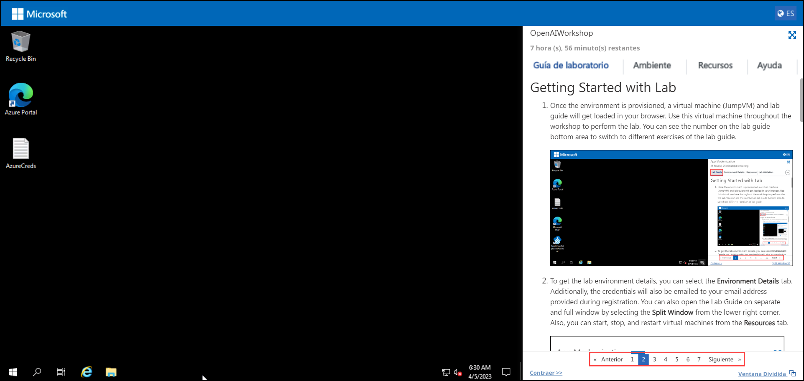
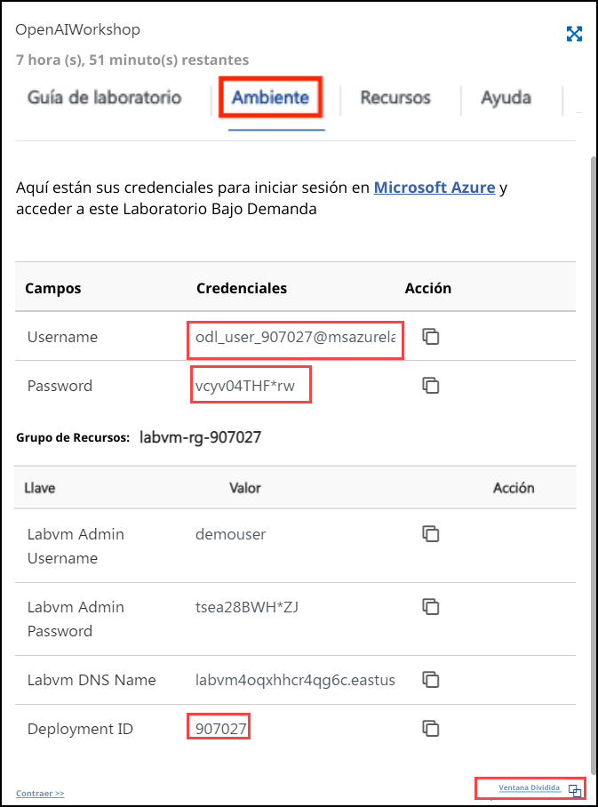
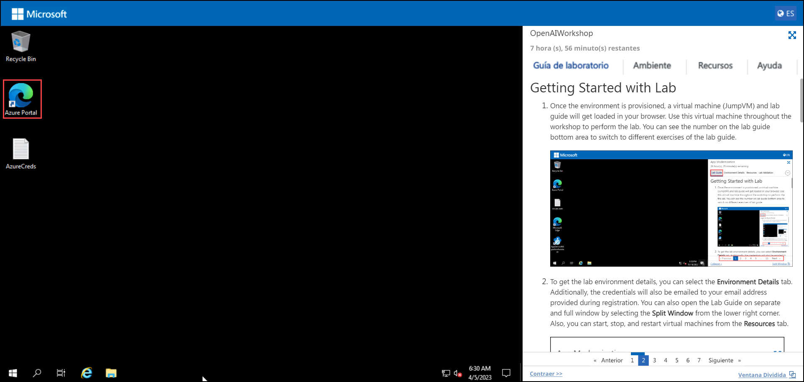
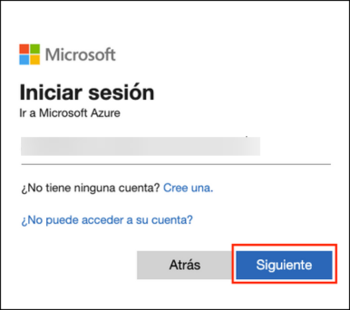
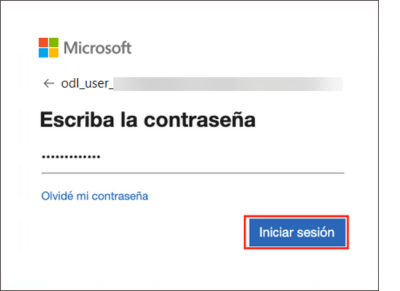
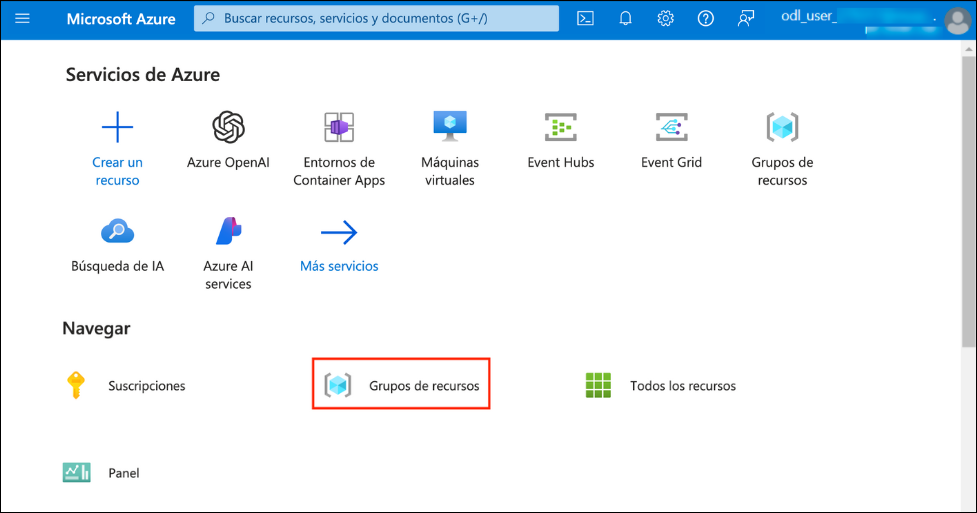
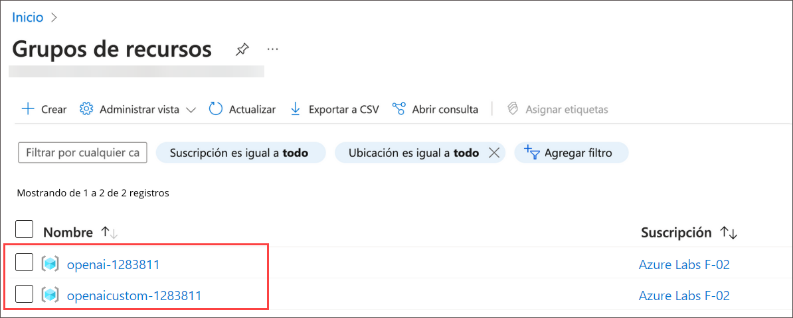

# Comenzando el Laboratorio

1. Una vez que se haya aprovisionado el ambiente de trabajo, se cargarán una máquina virtual (JumpVM) y una guía de laboratorio en su navegador. Utilice esta máquina virtual en todo el taller para realizar la práctica de laboratorio. Puede ver el número en el área inferior de la guía de laboratorio para cambiar a diferentes ejercicios de la guía de laboratorio.

   

1. Para obtener los detalles del ambiente del laboratorio, puede seleccionar la pestaña **Ambiente**. Además, las credenciales también se enviarán por correo electrónico a la dirección de correo electrónico proporcionada durante el registro. También puede abrir la Guía de laboratorio en una ventana completa e independiente seleccionando **Ventana separada** en la esquina inferior derecha. Además, puede iniciar, detener y reiniciar máquinas virtuales desde la pestaña **Recursos**.

   
 
    > Verá el valor SUFFIX en la pestaña **Ambiente**; úselo dondequiera que vea SUFFIX o Deployment ID en los pasos del laboratorio.

## Inicie Sesión en el Portal de Azure

1. En JumpVM, haga clic en el acceso directo de Azure Portal del navegador Microsoft Edge desde el escritorio.

   

1. En la página Bienvenido a Microsoft Edge, seleccione **Comenzar sin sus datos**, y en la página de ayuda para importar datos de navegación de Google seleccione el botón **Continuar sin estos datos** y proceda a seleccionar **Confirmar y comenzar a navegar** en la página siguiente.
   
1. En la pestaña **Iniciar sesión en Microsoft Azure** verá una pantalla de inicio de sesión, ingrese el siguiente correo electrónico/nombre de usuario y luego haga clic en **Siguiente**.  
   * Correo electrónico/nombre de usuario: <inject key="AzureAdUserEmail"></inject>
   
     
     
1. Ahora ingrese la siguiente contraseña y haga clic en **Iniciar sesión**.
   * Contraseña: <inject key="AzureAdUserPassword"></inject>
   
     
     
1. Si ve la ventana emergente **¿Permanecer conectado?**, haga clic en No

1. Si ve la ventana emergente **¡Tiene recomendaciones gratuitas de Azure Advisor!**, cierre la ventana para continuar con la práctica de laboratorio.

1. Si aparece una ventana emergente **Bienvenido a Microsoft Azure**, haga clic en **Cancelar** para omitir el recorrido.
   
1. Ahora verá el Panel de Azure Portal, haga clic en **Grupos de recursos** en el panel Navegar para ver los grupos de recursos.

    
   
1. Confirme que tiene grupos de recursos presentes como se muestra en la siguiente captura de pantalla. Los últimos seis dígitos del nombre del grupo de recursos son únicos para cada usuario.

    
   
1. Ahora, haga clic en Siguiente en la esquina inferior derecha para pasar a la página siguiente.
