# Ejercicio 1: Crear un pipeline de Open AI para Ingerir Datos por Lotes, Realizar Operaciones Inteligentes y Analizar en Synapse

### Resumen

Este escenario permite el uso de OpenAI para resumir y analizar los registros de llamadas de servicio al cliente para la empresa ficticia Contoso. Los datos se incorporan a una cuenta de almacenamiento de blobs y luego se procesan mediante una Azure Function. La Azure Function devolverá el sentimiento del cliente, la oferta de producto sobre la que versaba la conversación, el tema de la llamada y un resumen de la llamada. Estos resultados se escriben en una ubicación designada separada en el almacenamiento de blobs. A partir de ahí, se utiliza Synapse Analytics para extraer los datos recién depurados y crear una tabla que pueda consultarse para obtener más información.

---
# Índice
- [Construir un Pipeline de Open AI para Ingerir Datos por Lotes, Realizar Operaciones Inteligentes y Analizar en Synapse](#ejercicio-1-crear-un-pipeline-de-open-ai-para-ingerir-datos-por-lotes-realizar-operaciones-inteligentes-y-analizar-en-synapse)
- [Resumen](#resumen)
- [Índice](#índice)
- [Diagrama de Arquitectura](#diagrama-de-arquitectura)
- [Implementación](#deployment)
    - [Paso 1. Ingesta de Datos en el Almacenamiento creado en el Paso 1](#tarea-1-ingesta-de-datos-en-la-cuenta-de-almacenamiento)
    - [Paso 2. Configurar un área de trabajo de Synapse](#tarea-2-configurar-un-área-de-trabajo-de-synapse)
        - [a. Iniciar Azure Cloud Shell](#a-iniciar-azure-cloud-shell)
        - [b. En Cloud Shell ejecutar los siguientes comandos:](#b-cargar-archivos-a-una-cuenta-de-almacenamiento)
        - [c. Crear la Tabla SQL de Destino](#a-crear-la-tabla-sql-de-destino)
        - [d. Crear Servicios Vinculados de Origen y Destino](#b-crear-servicios-vinculados-de-origen-y-destino)
        - [e. Crear Flujo de Datos en Synapse](#c-crear-flujo-de-datos-en-synapse)
        - [f. Crear Pipeline de Synapse](#d-crear-pipeline-de-synapse)
        - [g. Activar el Pipeline de Synapse](#e-activar-el-pipeline-de-synapse)
    - [Paso 3. Consultar Resultados en Nuestra Tabla SQL](#tarea-3-consultar-resultados-en-nuestra-tabla-sql)


# Diagrama de Arquitectura

   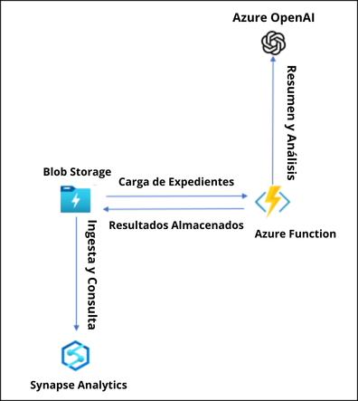

Los registros de llamadas se cargan en una ubicación designada en el almacenamiento de blobs. Esta carga activará la Azure Function, la cual utiliza [Azure OpenAI Service](https://azure.microsoft.com/en-us/products/cognitive-services/openai-service/) para la creación de resúmenes, el análisis de sentimientos, la oferta de producto sobre la que versaba la conversación, el tema de la llamada y un resumen de la llamada. Estos resultados se escriben en una ubicación designada separada en el almacenamiento de blobs. A partir de ahí, se utiliza Synapse Analytics para extraer los datos recién depurados y crear una tabla que pueda consultarse para obtener más información. 

## Tarea 1: Ingesta de Datos en la Cuenta de Almacenamiento

### A. Iniciar Azure Cloud Shell

1. En el [Portal de Azure](https://portal.azure.com?azure-portal=true), seleccione el botón **[>_]** (*Cloud Shell*) ubicado en la parte superior de la página a la derecha de la caja de de búsqueda. Se abrirá un panel de Cloud Shell en la parte inferior del portal. 

    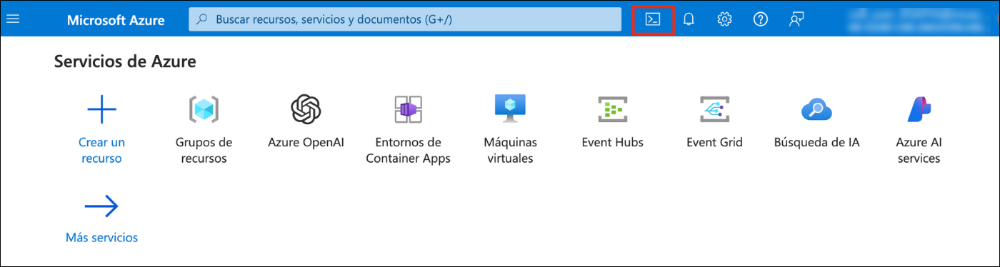

2. La primera vez que abra Cloud Shell, es posible que se le solicite que elija el tipo de Shell que desea usar (*Bash* o *PowerShell*). Seleccione **Bash**. Si no ve esta opción, omita el paso.

3. En el panel Introducción, seleccione **Montar cuenta de almacenamiento (1)**, seleccione su **suscripción de Cuenta de Almacenamiento (2)** del menú desplegable y haga clic en **Aplicar (3)**. 

   .png)

4. En el panel **Montar cuenta de almacenamiento**, elija **Seleccionar cuenta de almacenamiento existente (1)** y haga clic en **Siguiente (2)**.

   .png)

5. Dentro del panel **Configuración Avanzada**, ingrese los siguientes detalles:

    - **Suscripción**: Predeterminada- Elija la única suscripción existente asignada para esta práctica de laboratorio (1).
    - **Grupo de Recursos**: Elija **Usar existente** **(2)**
      - openai-<inject key="DeploymentID" enableCopy="false"></inject>
    - **Cuenta de Almacenamiento**: Elija **Usar existente** **(3)**
      - openaistorage<inject key="DeploymentID" enableCopy="false"></inject>
    - **Recurso compartido de archivos**: crear un recurso compartido de archivos **(4)**

      .png)

1. Establezca el nombre del recurso compartido de archivos como **blob (1)**, y haga clic en **Seleccionar (2)**.

    .png)

1.  Una vez creada la cuenta de almacenamiento, aparecerá la ventana Bash, tal como se muestra en la siguiente captura de pantalla:
    
    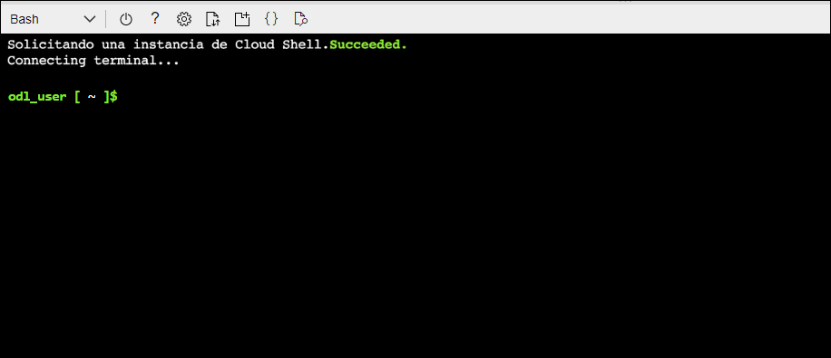

### B. Cargar archivos a una cuenta de almacenamiento:

1. Ejecute los siguientes comandos en Cloud Shell para descargar e instalar Miniconda.

     ```bash 
     wget https://repo.anaconda.com/miniconda/Miniconda3-py39_23.1.0-1-Linux-x86_64.sh 
     ```

     ```bash 
     sh Miniconda3-py39_23.1.0-1-Linux-x86_64.sh 
     ```
    
    > **Nota:** Los siguientes comandos funcionan en Bash; asegúrese de utilizar **Bash** en Cloud Shell. 
    
    > **Nota:** Presione la tecla de flecha hacia abajo para leer u omitir el acuerdo de licencia.

1. Escriba **yes** y presione **enter** para aceptar el acuerdo, y luego presione Enter para instalar en la ruta predeterminada. 

   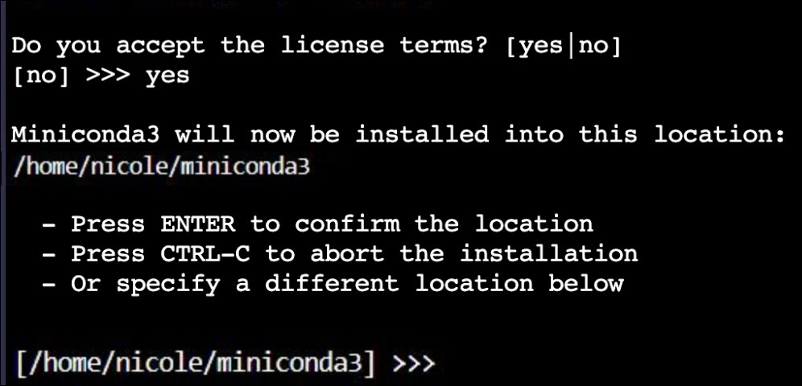

1. Escriba **yes** y presione **enter** para inicializar el entorno de conda.

    

1. Ejecute el siguiente comando para almacenar la ruta de instalación de miniconda en la variable.

    ```bash 
    export PATH=~/miniconda3/bin:$PATH
    ```
1. Ejecute los siguientes comandos para crear y activar el entorno conda en Cloud Shell.

    ```bash 
    git clone https://github.com/microsoft/OpenAIWorkshop.git
    cd OpenAIWorkshop/scenarios/openai_batch_pipeline/document_generation
    conda create -n document-creation
    conda activate document-creation
    pip install --upgrade pip
    pip install -r reqs.txt
    ```
    > **Nota**: si recibe el error **"Conda: command not found"**, por favor cierre la sesión de Cloud Shell y abra una nueva sesión para continuar.
    
1. Presione la tecla **y** y luego presione Enter para continuar.

1. En el [Portal de Azure](https://portal.azure.com), navegue hasta su recurso de Cuenta de almacenamiento con el sufijo `functions` seleccionando el grupo de recursos **openai-<inject key="DeploymentID" enableCopy="false"/>** y seleccionando la Cuenta de Almacenamiento de la lista de recursos.

    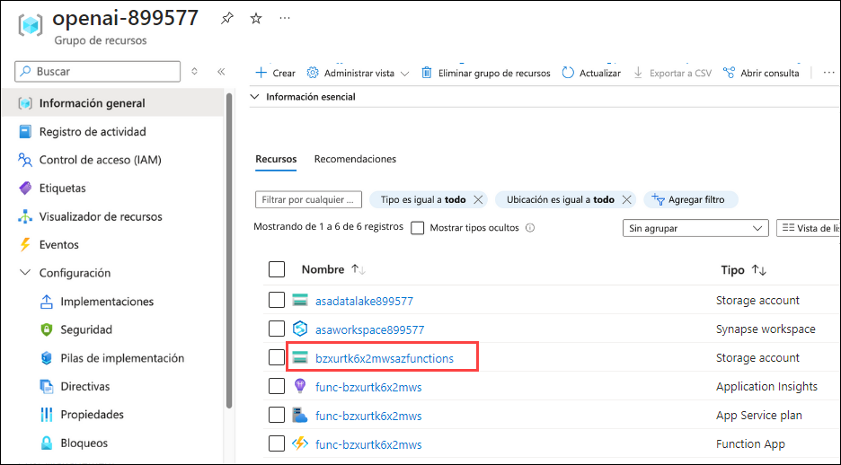
    
1. Cambie a la hoja **Claves de acceso (1)** y seleccione **Mostrar (2)**, el cual está al lado del valor de Cadena de conexión. Seleccione el botón copiar para la primera **cadena de conexión (3)**. Pegue el valor en un editor de texto, como Notepad.exe, a fin de poderlo consultar más adelante. 

   

1. Vuelva a la sesión de bash de Cloud Shell y ejecute el siguiente comando para cargar los archivos JSON en la cuenta de almacenamiento reemplazando <CONNECTION_STRING> por el valor que copió en el paso anterior. Esto tardará unos minutos en completarse.

    ```bash 
    python upload_docs.py --conn_string "<CONNECTION_STRING>"
    ```

   

   > **Note**: Ejecute "cd OpenAIWorkshop scenarios/openai_batch_pipeline/document_generation" si no está dentro del directorio OpenAIWorkshop/scenarios/openai_batch_pipeline/document_generation.
   
1. Una vez que haya cargado correctamente los archivos JSON en la cuenta de almacenamiento, puede navegar hasta la cuenta de almacenamiento en el Portal de Azure y verificar que los archivos se hayan cargado.

   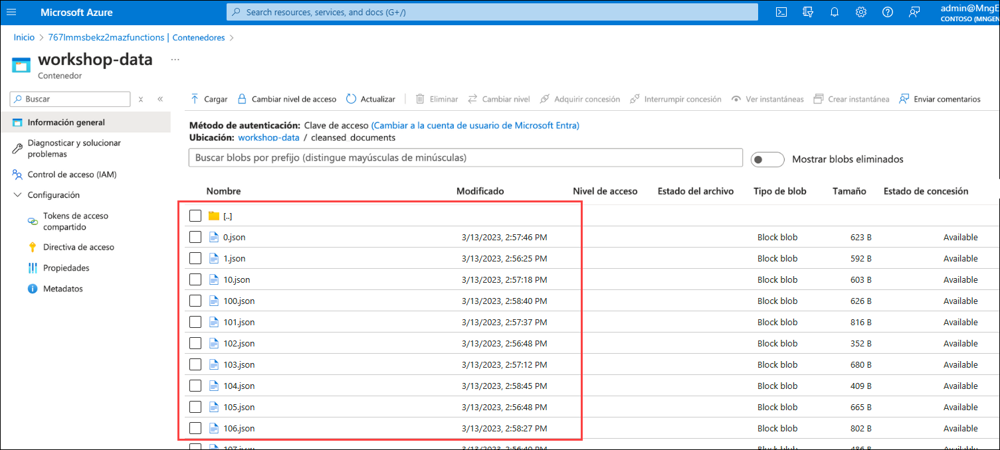

## Tarea 2: Configurar un área de trabajo de Synapse

### **A. Crear la Tabla SQL de Destino** 

1. En el [Portal de Azure](https://portal.azure.com), navegue hasta el área de trabajo de Synapse **asaworkspace<inject key="DeploymentID" enableCopy="false"/>** del grupo de recursos **openai-<inject key="DeploymentID" enableCopy="false"/>**. En la pestaña **Información general**, haga clic en **Abrir** para iniciar el espacio de trabajo de Synapse.

    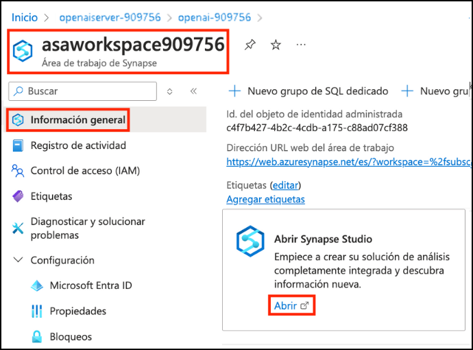

1. Haga clic en la sección **Desarrollar (1)** de Synapse Studio, haga clic en el signo **+ (2)** en la parte superior izquierda y seleccione **Script SQL (3)**. Esto abrirá una nueva ventana con un editor de script SQL. 

   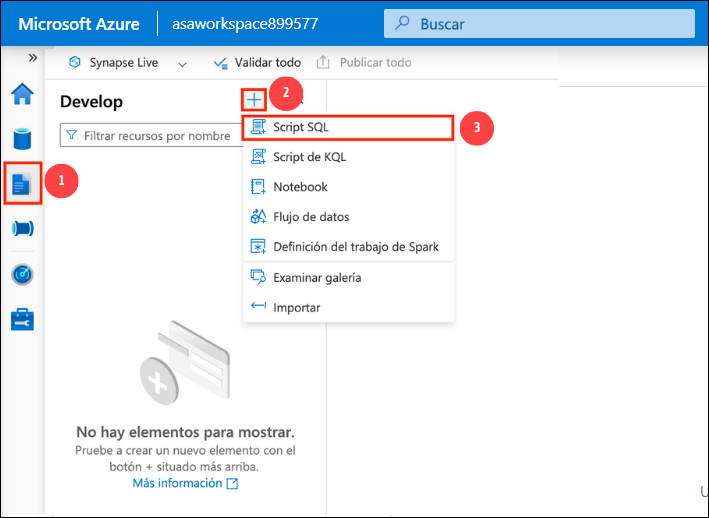

1. Copie y pegue el siguiente script en el editor **(1)**, luego cambie el valor **Conectar a** seleccionando **openaisql (2)** del menú desplegable, y en **Usar base de datos**, asegúrese de que **openaisql (3)** esté seleccionado, y haga clic en el botón **Ejecutar (4)** en la esquina superior izquierda, tal como se muestra en la siguiente imagen. Termine este paso presionando **Publicar todo (5)** justo encima del botón **Ejecutar** para publicar nuestro trabajo hasta el momento.

    ```SQL 
    CREATE TABLE [dbo].[cs_detail]
    (
    interaction_summary varchar(8000),
    sentiment varchar(500),
    topic varchar(500),
    product varchar(500),
    filename varchar(500)
    )
    ```
    
    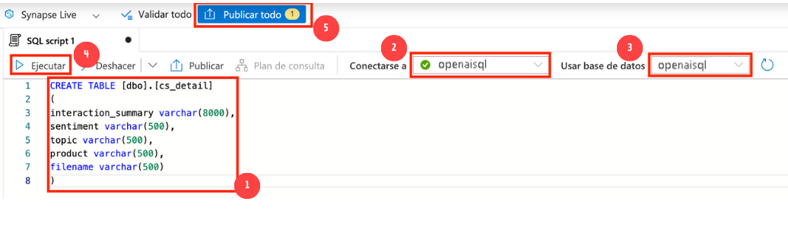
    
1. A continuación, haga clic en **Publicar** para publicar el script SQL.

    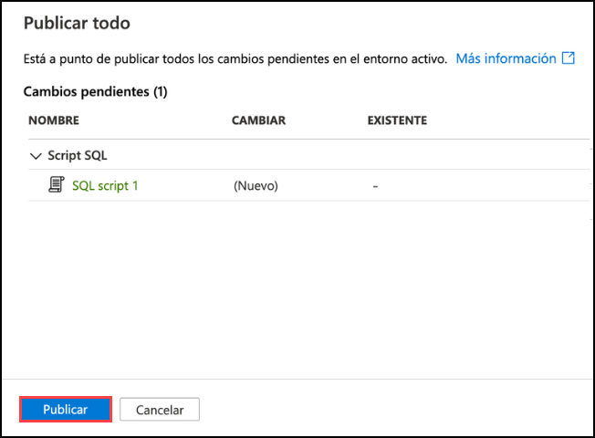

### **B. Crear Servicios Vinculados de Origen y Destino**

A continuación, necesitaremos crear dos servicios vinculados: uno para nuestra fuente (los archivos JSON en el Data Lake) y otro para la base de datos SQL Synapse que alberga la tabla que creamos en el paso anterior.

1. Vuelva a hacer clic en la sección **Administrar (1)** en Synapse Studio y haga clic en la opción **Servicios vinculados (2)** debajo de la sección **Conexiones externas**. Luego haga clic en **+ Nuevo (3)** en la esquina superior izquierda.

   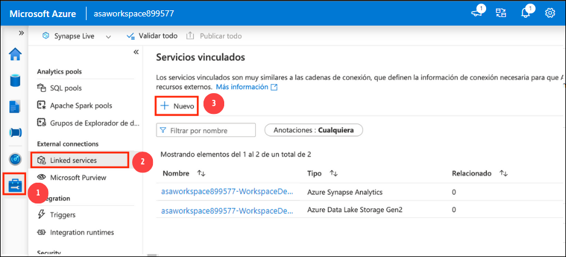
   
1. Comience creando los servicios vinculados para la fuente de nuestros datos, los archivos JSON alojados en el almacenamiento ADLS Gen2 que creamos con nuestra plantilla inicial. En la barra de búsqueda que se abre después de hacer clic en Nuevo, busque **blob (1)**, seleccione **Azure Blob Storage (2)** como se muestra a continuación y haga clic en **Continuar (3)**.

   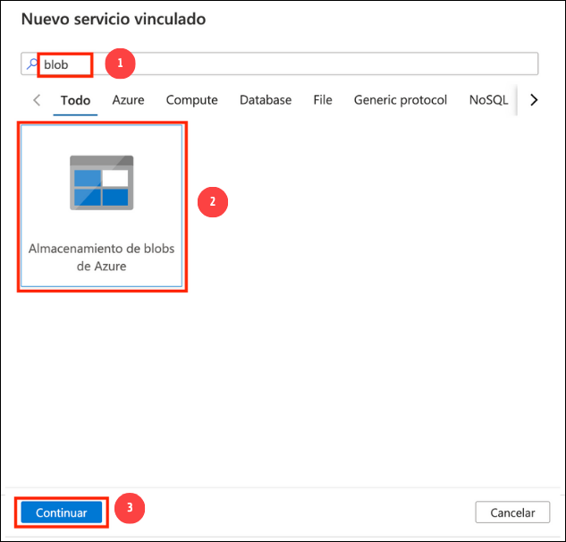

1. Proporcione el nombre para su servicio vinculado como **openailinkedservice (1)**. Cambie el **Tipo de Autenticación** a **Clave de cuenta (2)**. Luego seleccione la **suscripción (3)** en la que ha estado trabajando, finalmente, seleccione la cuenta de almacenamiento con el sufijo **functions (4)** que creó en la plantilla inicial y donde cargó los archivos JSON, luego haga clic en **Probar conexión (5)**. Una vez que la conexión sea exitosa, haga clic en el botón azul **Crear (6)** en la parte inferior izquierda de la ventana Nuevo servicio vinculado.

   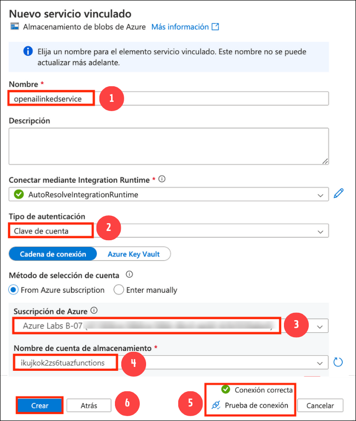

1. Haga clic en **+ Nuevo** en la esquina superior izquierda. Busque **Synapse (1)**, seleccione **Azure Synapse Analytics (2)** y haga clic en **Continuar (3)**.

     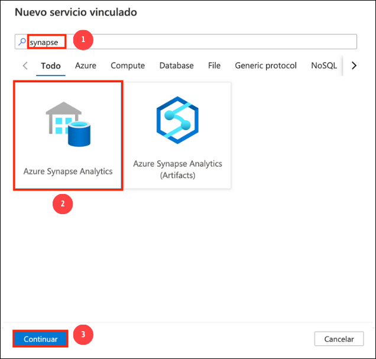

1. En la ventana *Nuevo servicio vinculado* que se abre, ingrese **synapselinkedservice** **(1)** para el nombre de su servicio vinculado de destino. Seleccione la **suscripción de Azure (2)** con la cual ha estado trabajando. Seleccione **asaworkspace<inject key="DeploymentID" enableCopy="false"/> (3)** para el **Nombre del servidor** y utilice **openaisql (4)** para el **Nombre de la base de datos**. Asegúrese de cambiar el **Tipo de autenticación** a **Identidad Administrada Asignada por el Sistema (5)**, luego haga clic en **Probar conexión (6)** y haga clic en **Crear (7)**.

    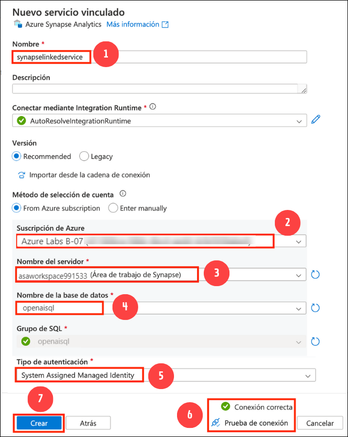

1. Una vez que haya creado los dos servicios vinculados, asegúrese de presionar el botón **Publicar todo** en la parte superior para publicar nuestro trabajo. Finalice la creación de los servicios vinculados y haga clic en **Publicar**.

   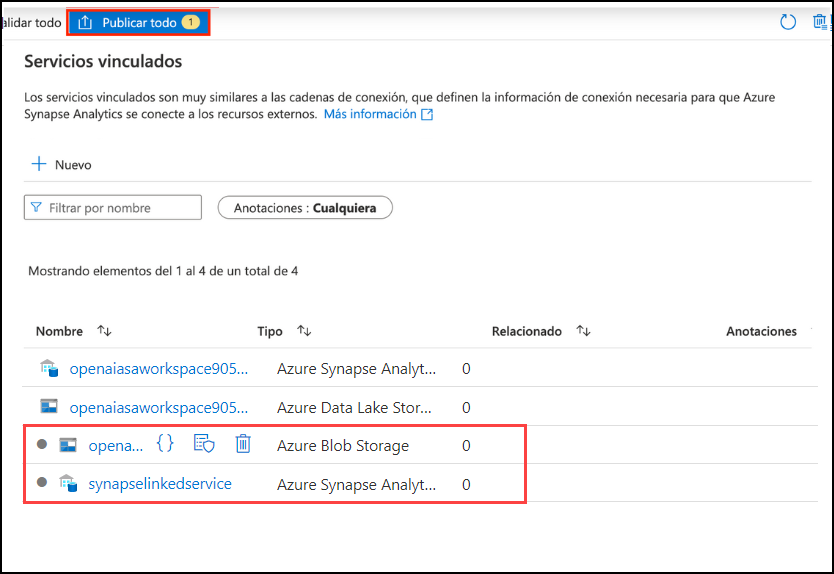
   
### **C. Crear Flujo de Datos en Synapse**

Mientras todavía estamos dentro de Synapse Studio, ahora necesitaremos crear un **flujo de datos** para ingerir nuestros datos JSON y escribirlos en nuestra base de datos SQL. Para este taller, será un flujo de datos muy simple que ingiere los datos, cambia el nombre de algunas columnas y vuelve a escribir la información en la tabla de destino.

1. Primero, queremos volver a la pestaña **Desarrollar (1)**, seleccionar **+ (2)** y luego **Flujo de datos (3)**.

   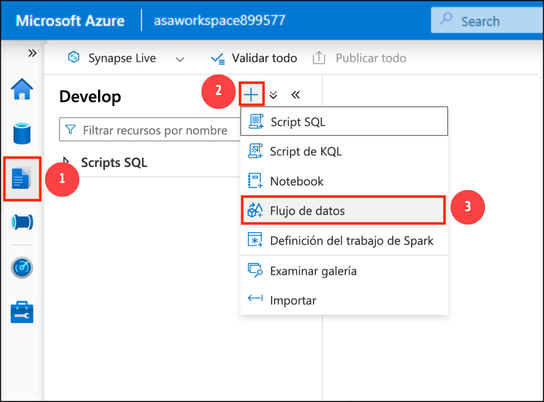
   
1. Una vez que se abra el editor de flujo de datos, haga clic en **Agregar origen**. Se abrirá una nueva ventana en la parte inferior de la pantalla. Seleccione **+ Nuevo** en la fila **Conjunto de datos** y deje las otras opciones con los valores predeterminadps.

   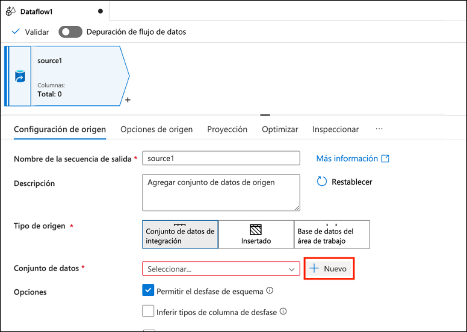

1. Debería abrirse una nueva ventana en el lado derecho de la pantalla. A continuación, busque **blob (1)**, seleccione **Azure Blob Storage (2)** y luego haga clic en **Continuar (3)**.
   
   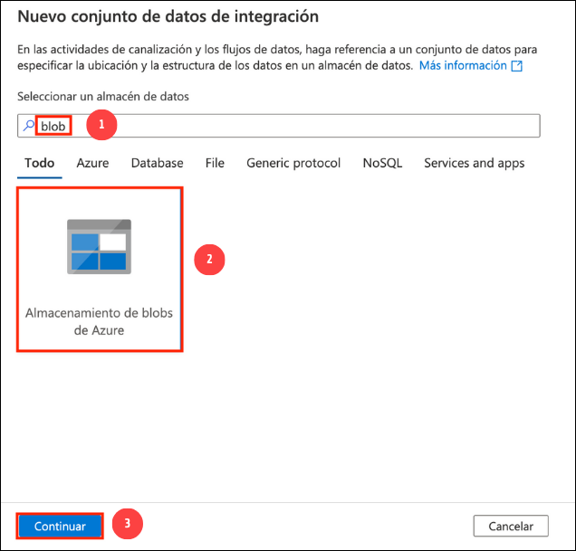

1. A continuación, seleccione la opción **JSON (1)** ya que nuestros datos entrantes están en formato JSON y haga clic en **Continuar (2)**.

   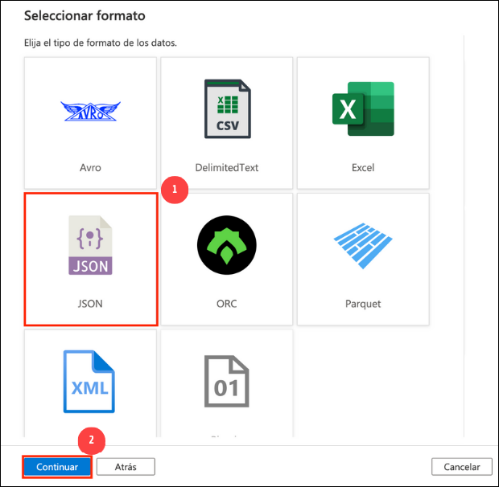

1. Seleccione el Servicio Vinculado con el nombre **openailinkedservice (1)** que acabamos de configurar en los pasos anteriores. Deberá seleccionar la **Ruta del archivo** adecuada para seleccionar el directorio donde se almacenan nuestros archivos JSON. Debería ser algo parecido a **workshop-data / cleansed_documents (2)**. Haga clic en el botón **Aceptar** para cerrar la ventana.

   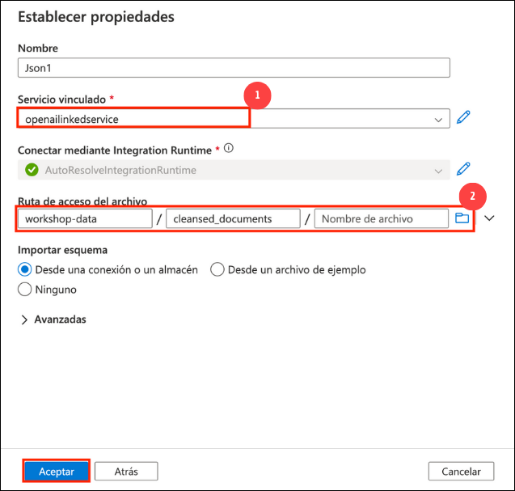
   
1. A continuación, tendremos que ir al panel **Opciones de origen (1)** y desplegar las opciones de **Configuración JSON (2)**. Necesitamos cambiar la opción **Formulario de documento** a la configuración **Array of documents (3)**. Esto permite que nuestro flujo lea cada archivo .JSON como una entrada separada en nuestra base de datos.

   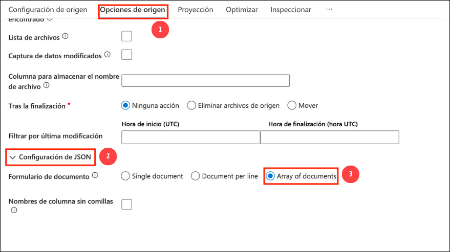   

1. Habilite la opción sesión de **depuración de flujo de datos** ubicada en la barra de menú superior adyacente al botón de validación y haga clic en **OK** en la ventana emergente *Activar depuración de flujo de datos*.

    >**Nota:** La sesión de **depuración de flujo de datos** tardará uno o dos minutos en habilitarse.

1. Ahora diríjase a la pestaña **Vista previa de datos** y ejecute una previsualización para comprobar su trabajo hasta el momento.
    
    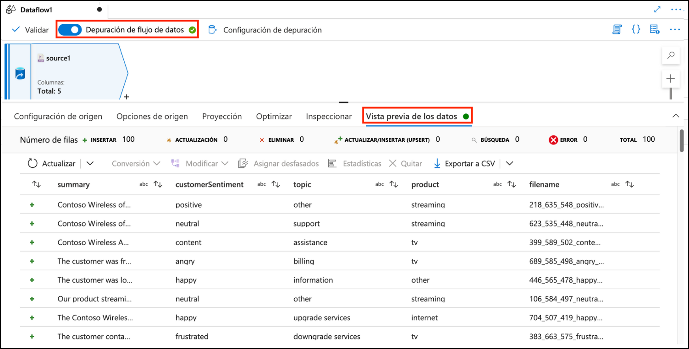

    >**Nota**: Si no puede ver los datos en la pestaña Vista Previa de Datos, por favor haga clic en el botón Actualizar repetidamente hasta que aparezcan los datos.
   
1. A continuación, podemos agregar en nuestro cuadro **Seleccionar** y realizar modificaciones menores antes de escribir los datos en la tabla SQL de Synapse. Para comenzar, haga clic en el pequeño signo **+ (1)** junto a nuestro cuadro de ingesta y elija la opción **Seleccionar (2)**.

   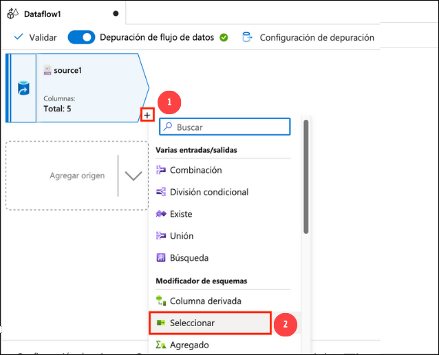

1. Podemos dejar todas las configuraciones con los valores por defecto. A continuación, agregaremos nuestro cuadro **Receptor**. Este es el paso que escribirá nuestros datos en nuestra base de datos SQL de Synapse. Haga clic en el pequeño signo **+ (1)** junto al cuadro **Seleccionar**. Desplácese hasta el final del menú de opciones y seleccione la opción **Receptor (2)**.

   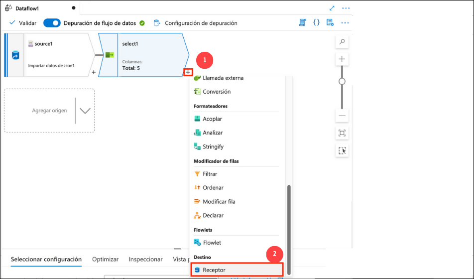

1. Una vez que se abra el cuadro **Receptor (1)**, elija **En línea (2)** para el *Tipo de Receptor*. Luego, seleccione **Azure Synapse Analytics (3)** para el *Tipo de conjunto de datos en línea* y, para el **Servicio vinculado**, seleccione **Synapselinkedservice (4)**, el cual fue creado en el paso anterior. Asegúrese de ejecutar **Probar conexión (5)** para el servicio vinculado.

   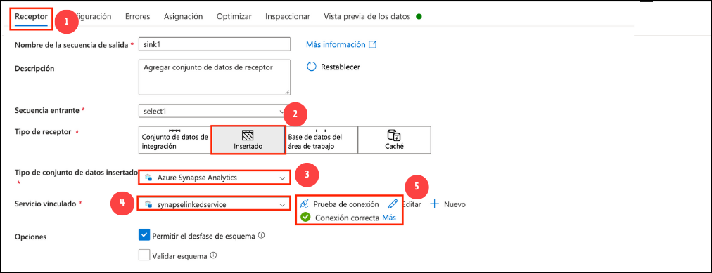

   > **Nota**: Si la conexión de prueba tarda más de 3 a 4 minutos, siga los pasos a continuación.

   - Haga clic en **Editar**.

     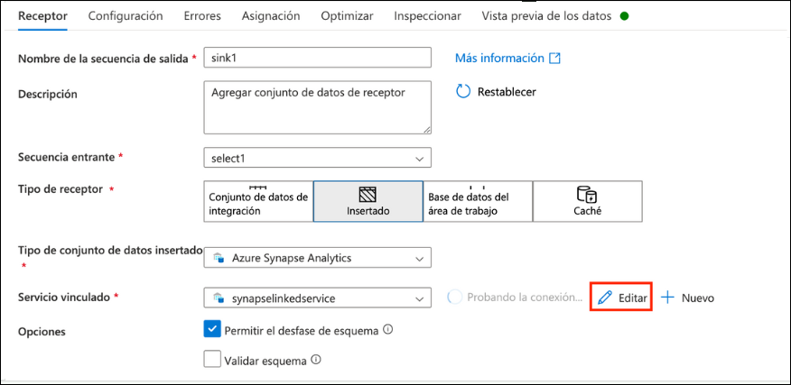    

   - En la ventana Editar servicio vinculado que se abre, seleccione el método de selección de Azure como **Desde la suscripción de Azure** **(1)**. Seleccione la **suscripción de Azure (2)** con la cual ha estado trabajando. Seleccione **asaworkspace<inject key="DeploymentID" enableCopy="false"/> (3)** para el **Nombre de servidor** y **openaisql (4)** como el **Nombre de la base de datos**, luego haga clic en **Probar conexión (5)** y finalice haciendo clic en **Guardar (6)**.

     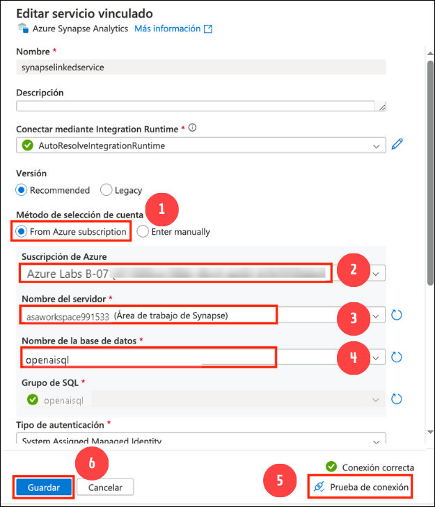

1. Luego tendremos que dirigirnos a la pestaña **Configuración (1)** y ajustar el **Nombre del esquema** y el **Nombre de la tabla**. Si utilizó el script proporcionado anteriormente para crear la tabla de destino, el nombre del esquema es **dbo (1)** y el nombre de la tabla es **cs_detail (2)**.

    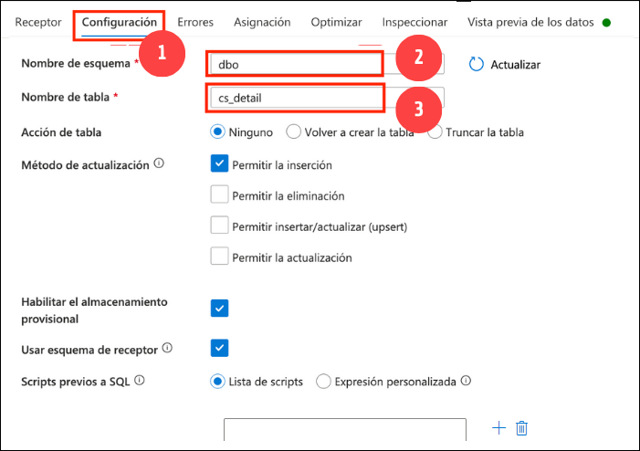

1. Antes de terminar nuestro trabajo en el flujo de datos, debemos obtener una vista previa de nuestros datos. La vista previa de nuestros datos revela que solo tenemos 3 columnas cuando esperamos un total de 5. Hemos perdido nuestras columnas Summary y Sentiment.

    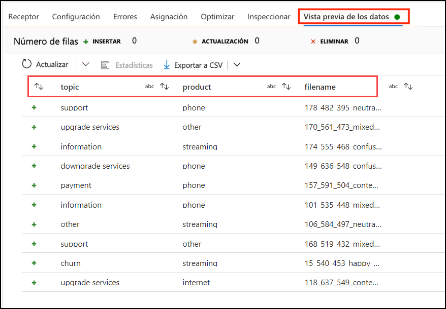

1. Para corregir esto, usemos nuestro cuadro **Seleccionar (1)** para cambiar los nombres de la siguiente manera para obtener los valores de salida esperados:

     - **Summary**: `interaction_summary` **(2)**
     - **CustomerSentiment**: `sentiment` **(3)**

        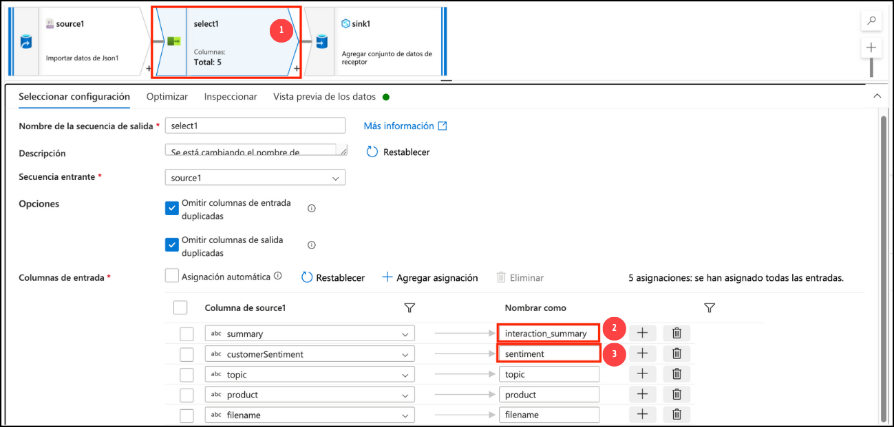
    
1. Si volvemos a nuestro cuadro **Receptor (1)** y en **Vista previa de datos (2)** hacemos clic en **Actualizar (3)**, ahora veremos las 5 columnas de salida esperadas.

    

1. Una vez que haya revisado los datos y esté satisfecho de que todas las columnas se hayan asignado correctamente (debería tener 5 columnas en total, todas mostrando datos en formato de cadena), podemos presionar **Publicar todo** en la parte superior para guardar nuestra configuración actual. Se abrirá una ventana en el lado derecho de la pantalla; presione el botón azul **Publicar** en la parte inferior izquierda para guardar los cambios.

    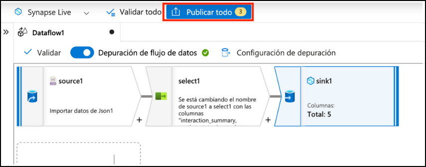

1. Su Flujo de Datos completo y guardado tendrá el siguiente aspecto:

    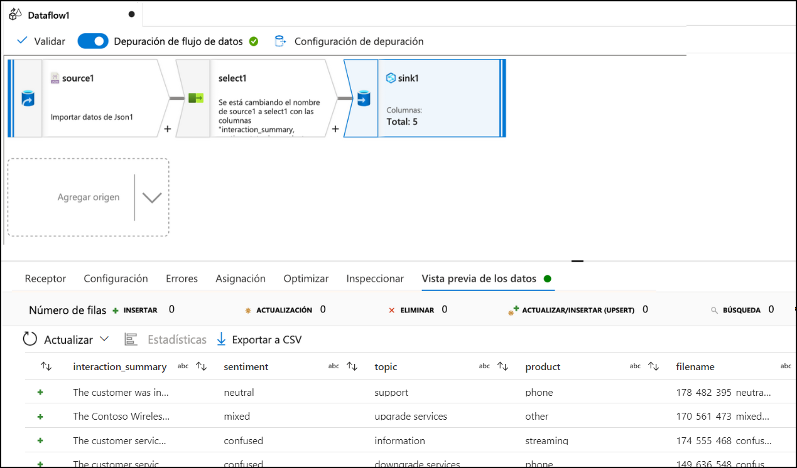

### **D. Crear Pipeline de Synapse**

1. Una vez que hayamos creado nuestro **Flujo de datos**, necesitaremos configurar un **Pipeline** para alojarlo. Para crear un **Pipeline**, navegue hasta la barra de menú de la izquierda y elija la opción **Integrar (1)**. Luego haga clic en **+ (2)** en la parte superior del menú Integrar para **Agregar un nuevo recurso** y elija **Canalización (3)**.

   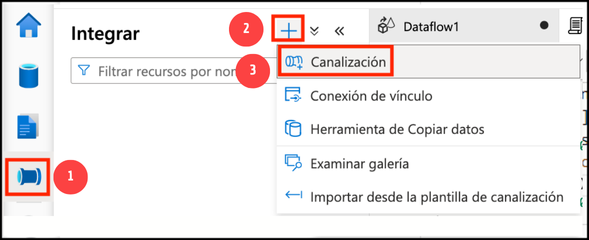

2. A continuación, debemos agregar un **Flujo de datos** a nuestro Pipeline. Con su nueva **pestaña Pipeline (1)** abierta, vaya a la sección **Actividades** y busque `datos` **(2)**, seleccione la actividad **Flujo de datos (3)** y **arrástrela (4)** hacia su Pipeline.

   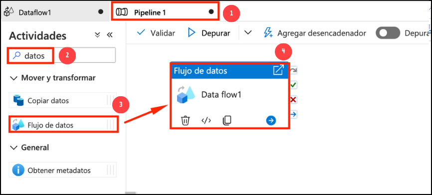

3. En la pestaña **Configuración (1)** del **Flujo de datos**, seleccione el menú desplegable **Flujo de datos (2)** y elija el nombre del flujo de datos que creó en el paso anterior.
Luego expanda la sección **Ensayo (3)** en la parte inferior de la configuración y utilice el menú desplegable para el **Servicio vinculado de Staging**. Elija el servicio vinculado **openailinkedservice (4)** que creó. Garantice la conexión realizando una **Prueba de conexión (5)**. A continuación, configure una **carpeta de almacenamiento de prueba** en la parte inferior e ingrese **workshop-data/Staging** **(6)**.

   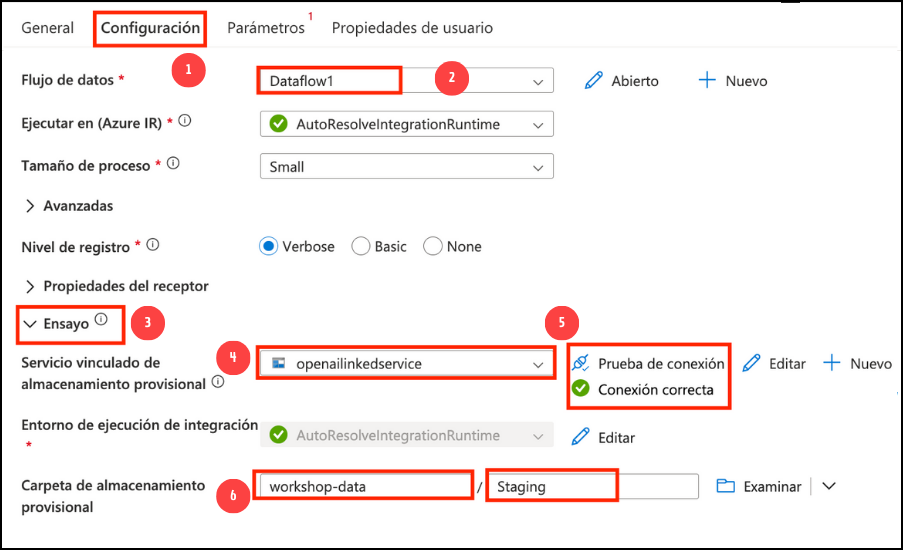

4. Luego, haga clic en **Publicar todo** para publicar sus cambios y guardar su progreso.

### **E. Activar el Pipeline de Synapse**

1. Una vez que haya publicado con éxito su trabajo, debemos activar nuestro canal. Para hacer esto, justo debajo de las pestañas en la parte superior de Synapse Studio, hay un ícono de *rayo* que dice **Agregar desencadenador (1)**. Haga clic en él para agregar un activador y seleccione **Desencadenar ahora (2)** para comenzar una ejecución del pipeline; luego, cuando se abra la ventana, haga clic en **OK**.

    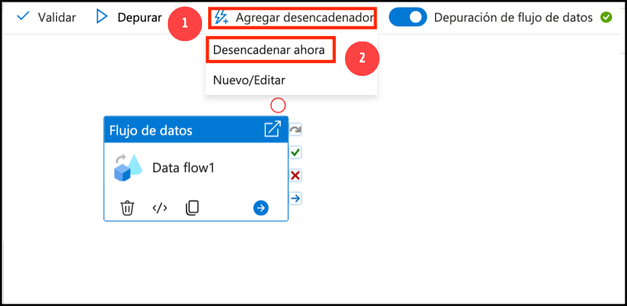
    
2. Para ver la ejecución del pipeline, navegue hasta el lado izquierdo de la pantalla y elija la opción **Monitorear (1)**. Luego seleccione la opción **Pipeline runs (2)** en la sección **Integration**. Verá la ejecución del pipeline que desencadenó en la sección **Desencadenado (3)** como **pipeline 1 (4)**. Este pipeline debería tomar aproximadamente 4 minutos (si está utilizando los datos cargados para el taller).

   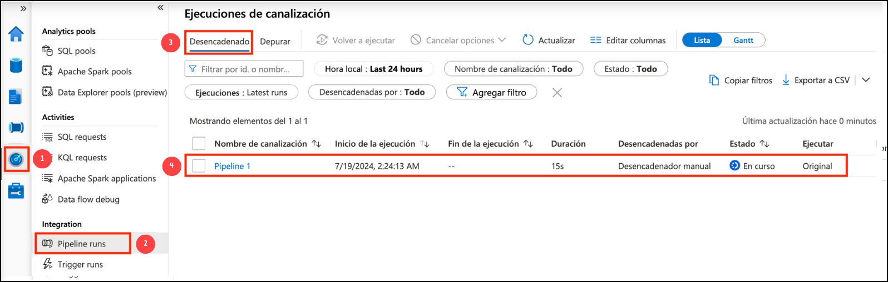

## Tarea 3: Consultar Resultados en Nuestra Tabla SQL

1. Asegúrese de que el estado de ejecución de su pipeline sea **Exitoso**.

    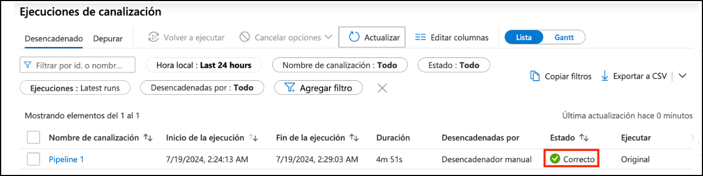

2. Ahora que los datos están en la tabla de destino, están disponibles para su uso ejecutando consultas SQL en ellos o conectando PowerBI y creando visualizaciones. La Azure Function también se está ejecutando, así que intente cargar algunos de los archivos de expedientes en la carpeta generate_documents localizada en su contenedor y observe cómo la función los procesa y crea un nuevo archivo en el archivo cleansed_documents.

3. Para consultar los nuevos datos, navegue hasta el menú del lado izquierdo y elija **Desarrollar (1)**. Haga clic en el **Script SQL (2)** existente y reemplace el contenido con el **Código SQL (3)** mostrado a continuación. Luego seleccione el grupo **openaisql (4)** y haga clic en **Ejecutar (5)**.

     ```SQL 
    SELECT sentiment, count(*) as "Sum of Sentiment"
    FROM [dbo].[cs_detail]
    GROUP BY sentiment
    ORDER BY count(*) desc     
     ```

   - Para los resultados de su consulta, si está utilizando los archivos cargados como parte de este repositorio o taller, debería ver **Resultados (6)** similares a los siguientes.

      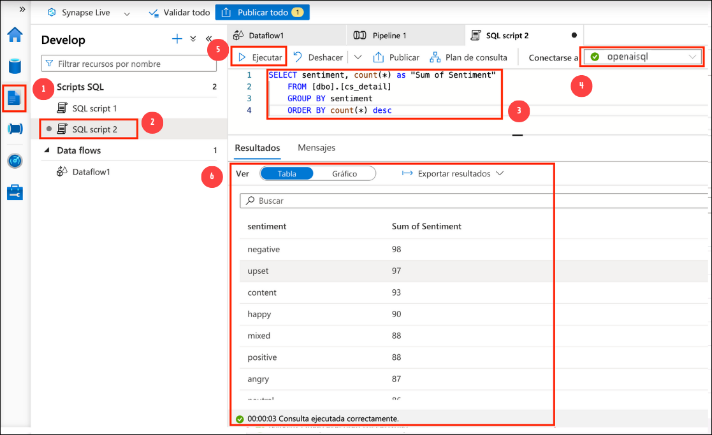
