# Ejercicio 3: Cree una Aplicación Open AI con Python

1. Busque y seleccione **Azure Synapse Analytics** en el Portal de Azure.

      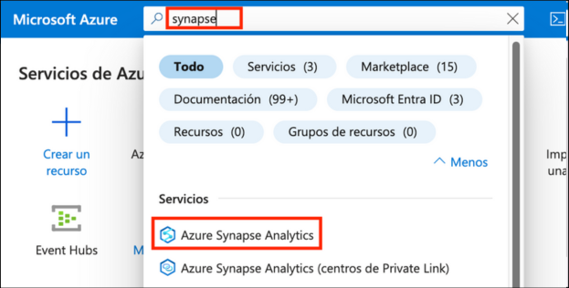

1. En la ventana **Azure Synapse Analytics** seleccione **asaworkspace<inject key="DeploymentID" enableCopy="false"/>**.   

1. En la hoja **Información general** de la sección **Introducción**, haga clic en **Abrir** para abrir Synapse Studio.
     
     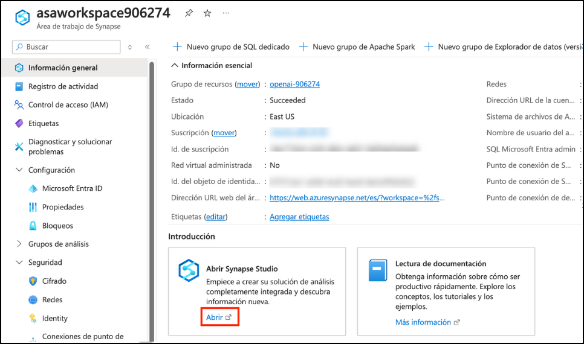
    
1. Haga clic en **Desarrollar (1)**, luego haga clic en **+ (2)** y seleccione **Importar**.

    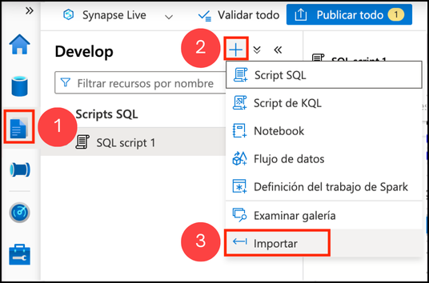

1. Navegue a la ubicación `C:\labfile\OpenAIWorkshop\scenarios\powerapp_and_python\python` y seleccione `OpenAI_notebook.ipynb`, luego haga clic en **Abrir**.

     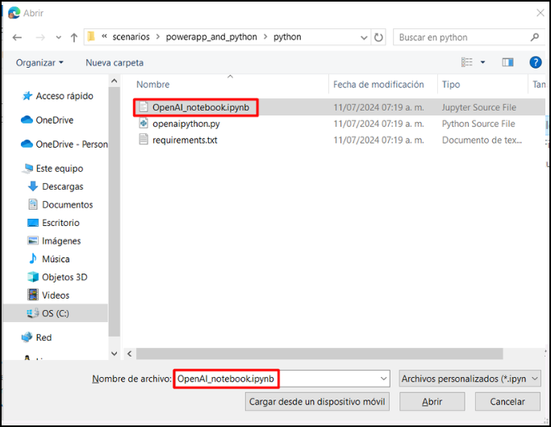

1. Seleccione **openaisparkpool** del menú desplegable **Adjuntar a**.

    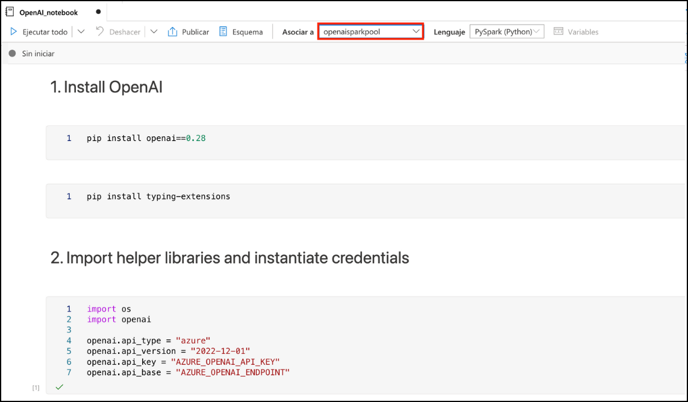

1. Ejecute el cuaderno paso a paso para completar este ejercicio. Haga clic en el botón **Ejecutar** al lado de la celda.

     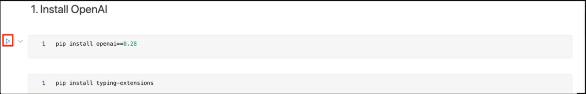

1. En **1. Install OpenAI**, haga clic en el botón **Ejecutar** junto a las primeras celdas y haga clic en **detener sesión**. Por favor espere hasta que los **grupos de Apache Spark** pasen al estado de detenido.

     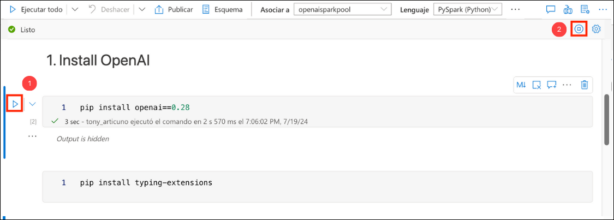

      > **Nota**: es posible que necesite reiniciar el kernel para usar los paquetes actualizados

1. En **2. Import helper libraries and instantiate credentials** reemplace **AZURE_OPENAI_API_KEY** y **AZURE_OPENAI_ENDPOINT** con su clave de API y la URL del punto de conexión.

     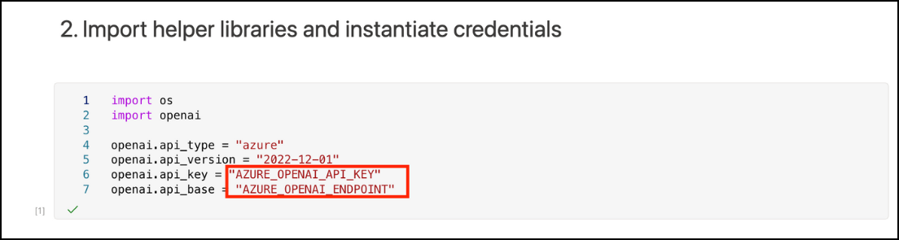
   
1. Desde el Portal de Azure, navegue hasta el grupo de recursos  **openaicustom-<inject key="DeploymentID" enableCopy="false"/>** y seleccione el recurso Azure OpenAI **asaworkspace<inject key="DeploymentID" enableCopy="false"/>**.

    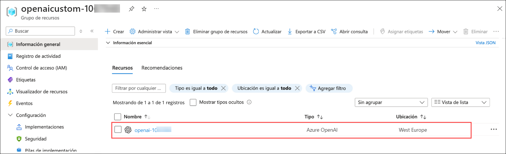

1. En Administración de Recursos, seleccione **Claves y punto de conexión (1)** y haga clic en **Mostrar claves (2)**. Copie la **Clave 1 (3)** y el **Punto de conexión (4)** y reemplace **AZURE_OPENAI_API_KEY** y **AZURE_OPENAI_ENDPOINT** con su clave de API y la URL del punto de conexión en el script.

   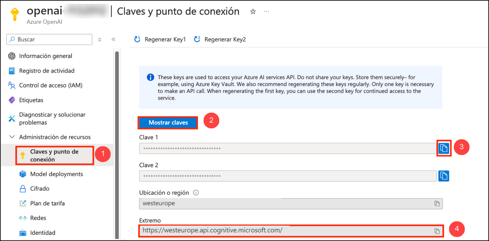
     
    > **Nota:** Si encuentra un error "Openai module not found", ingrese `%` antes de **pip install** en la celda Install OpenAI y vuelva a ejecutar el cuaderno.

1. Para **2. Choose a Model** reemplace el valor **model** de **text-curie-001** a **demomodel**.

    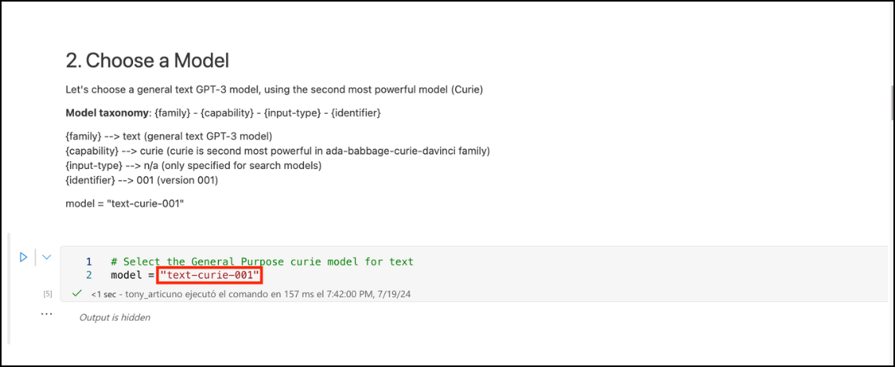

1. En **temperature**, reemplace el valor **engine** de **text-curie-001** a **demomodel**.

     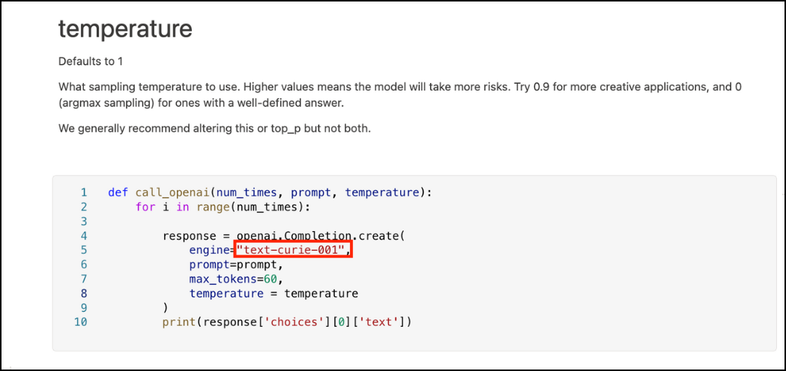

1. En **top_p**, reemplace el valor **engine** de **text-curie-001** a **demomodel**.

     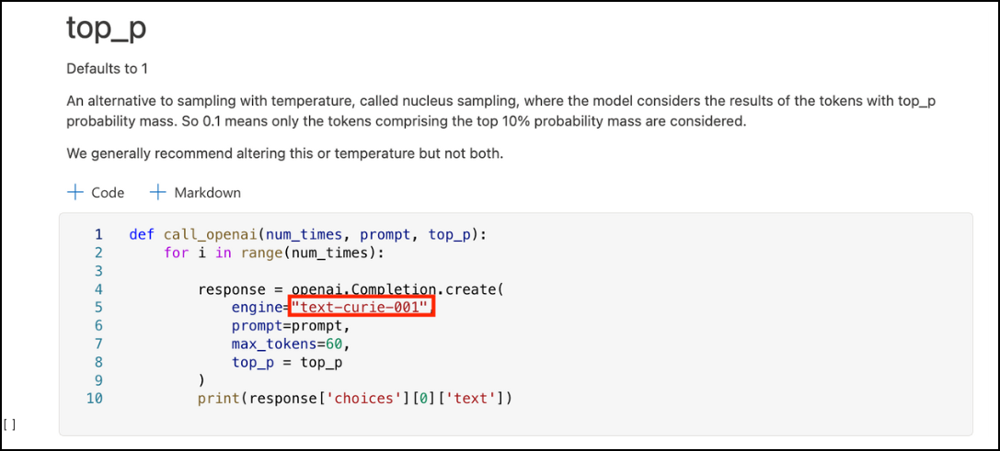

1. Para **n**, reemplace el valor **engine** de **text-curie-001** a **demomodel**.

     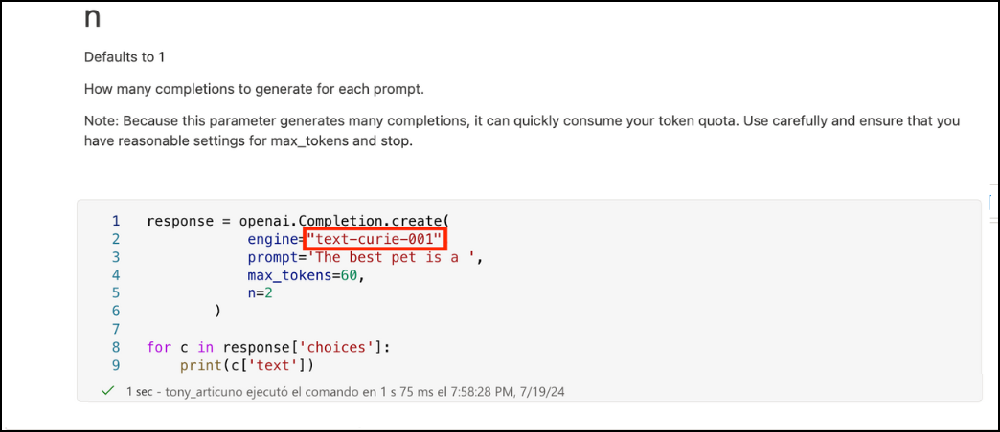

1. En **logprobs**, reemplace el valor **engine** de **text-curie-001** a **demomodel**.

     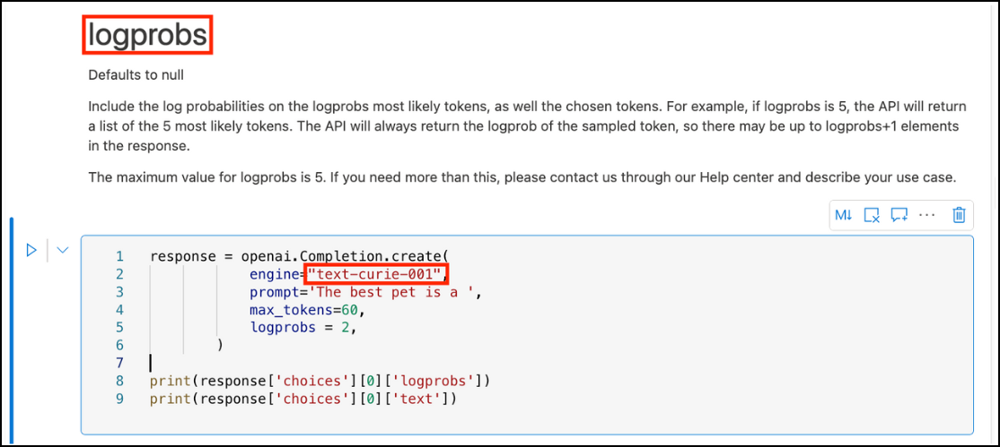

1. Después de ejecutar el cuaderno correctamente, haga clic en **Publicar todo**.

     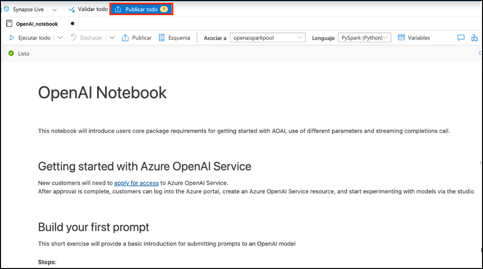

1. Luego haga clic en **Publicar** para guardar los cambios. 

    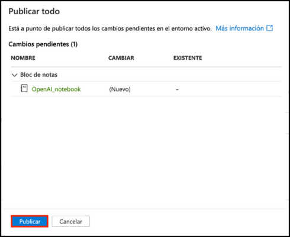
