# Ejercicio 2: Cree una aplicación Open AI con Power App

1. Navegue a https://make.powerapps.com/. En **Bienvenido a Power Apps**, seleccione su **País/Región (1)** y haga clic en **Comenzar (2)**. 

   
    
2. Seleccione **Aplicaciones** en el panel de navegación de la izquierda y haga clic en **Importar aplicación de lienzo**. 

    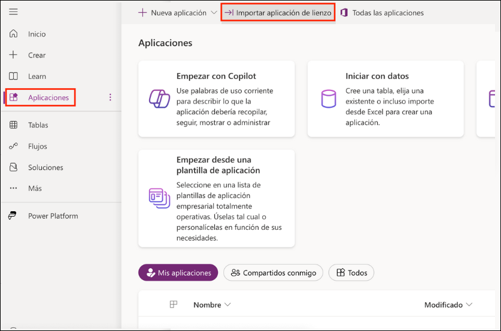

3. En la página **Importar paquete**, haga clic en **Cargar**

    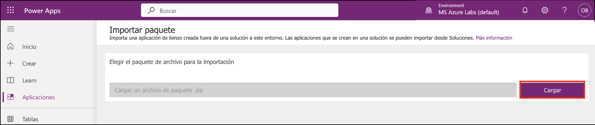

4. Navegue a `C:\labfile\OpenAIWorkshop-main\OpenAIWorkshop-main\scenarios\powerapp_and_python\powerapp`. Seleccione la carpeta **OpenAI-Playground_20230302010547.zip (1)** y haga clic en **Abrir (2)**.

     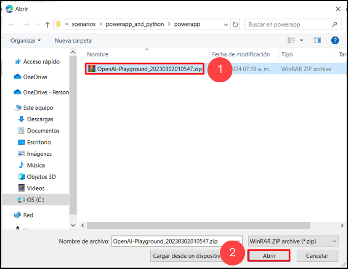

5. Una vez cargado el archivo zip, en **Revisar Contenido del Paquete** para **OpenAI Playground**, haga clic en el icono de configuración debajo de **Acción**.

     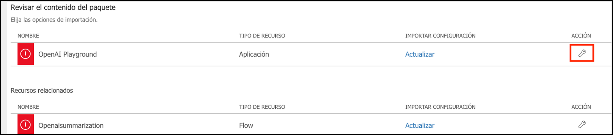

6. En el panel **Importar configuración**, seleccione **Crear como nueva (1)** del menú desplegable de **Configuración** y haga clic en **Guardar (2)**.

      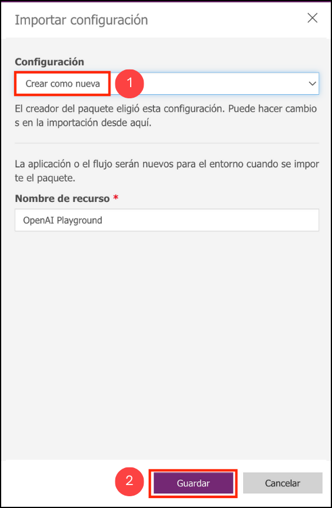

7. Repita los Pasos 5 y 6 para **Openaisummarization**.

8. A continuación, haga clic en **Importar** para importar el paquete al entorno de PowerApps.

   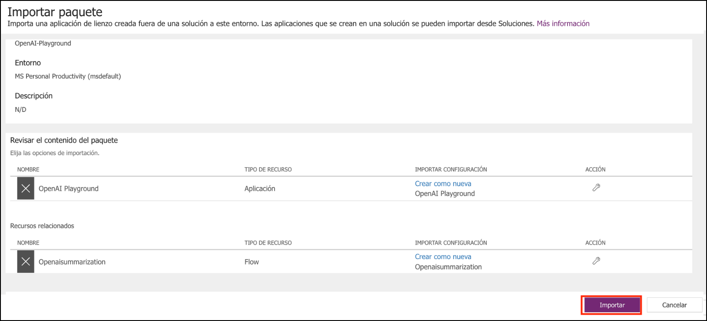

9. Una vez que se complete la importación, haga clic en **Aplicaciones (1)**, luego haga clic en `...` **(2)** junto a **OpenAI Playground** y haga clic en **Editar (3)**.

      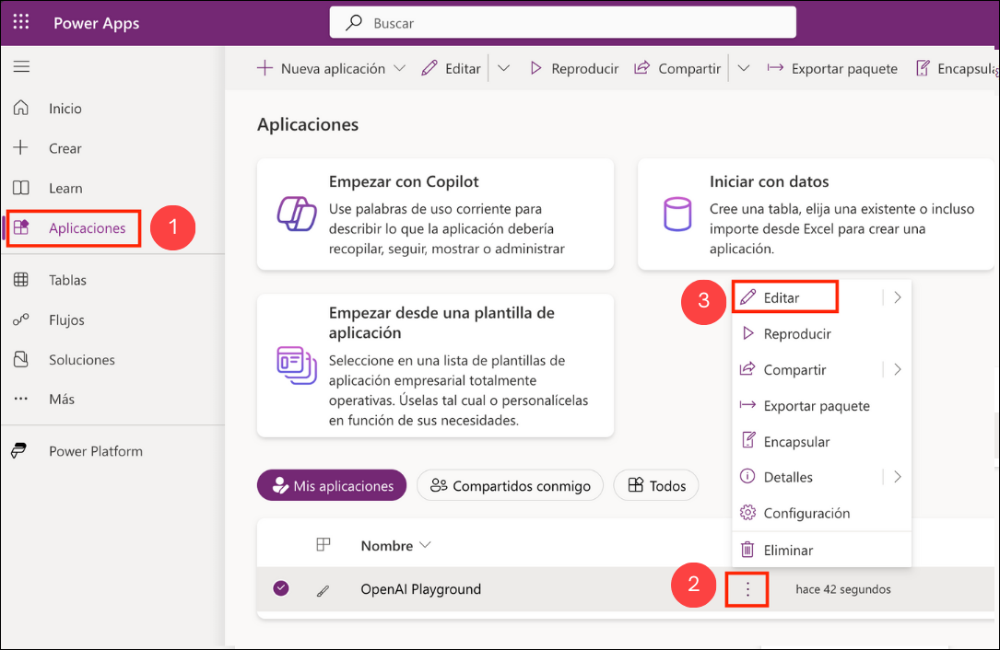

   >**Nota**: Si no puede ver la opción **OpenAI Playground**, por favor espere 5 minutos y, mientras tanto, intente actualizar la página.

10. Observará que ha importado la aplicación de lienzo Power App y el Power Automate Flow al espacio de trabajo.

      

11. Para navegar hacia atrás, haga clic en **Atrás (1)**, luego haga clic en **Salir (2)**.

      

12. A continuación, en la pestaña **Flujos (1)**, seleccione **Openaisummarization (2)**, luego haga clic en `...` **(3)** y **Activar (4)** su flujo.

      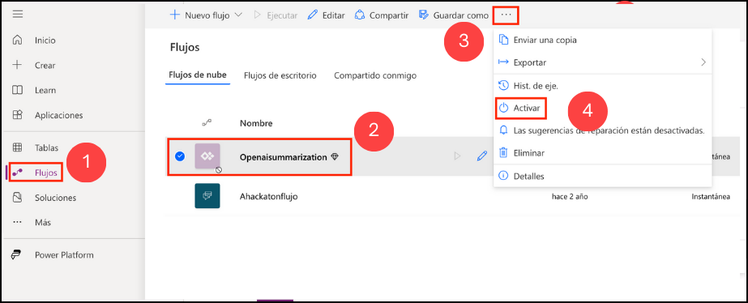

13. Haga clic en **Editar** para Openaisummarization.

      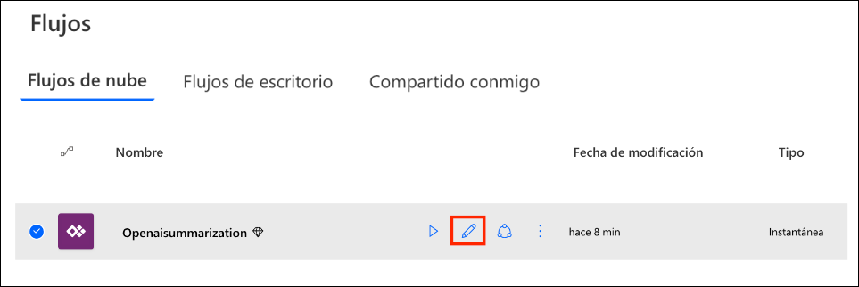

14. Edite el paso HTTP de Power Automate Flow actualizando **https://your-resource-name.openai.azure.com/** con **<inject key="OpenAIEndpoint" enableCopy="true"/>** **(1)**, **deployment-id** con **<inject key="openaimodulename" enableCopy="true"/>** **(2)**, **api-version** con **2023-09-15-preview** **(3)**, **YOUR_API_KEY** con **<inject key="OpenAIKey" enableCopy="true"/>** **(4)**, y haga clic en **Guardar** **(5)**. 

      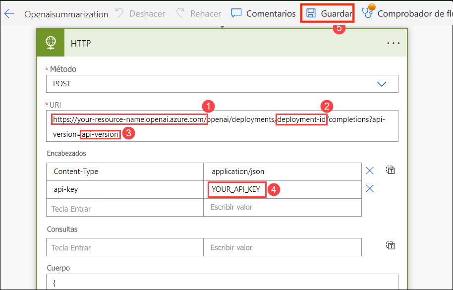
   
15. Desde la página **Aplicaciones (1)**, haga clic en la aplicación **OpenAI Playground** para ejecutarla haciendo clic en el botón **Play (2)**.

     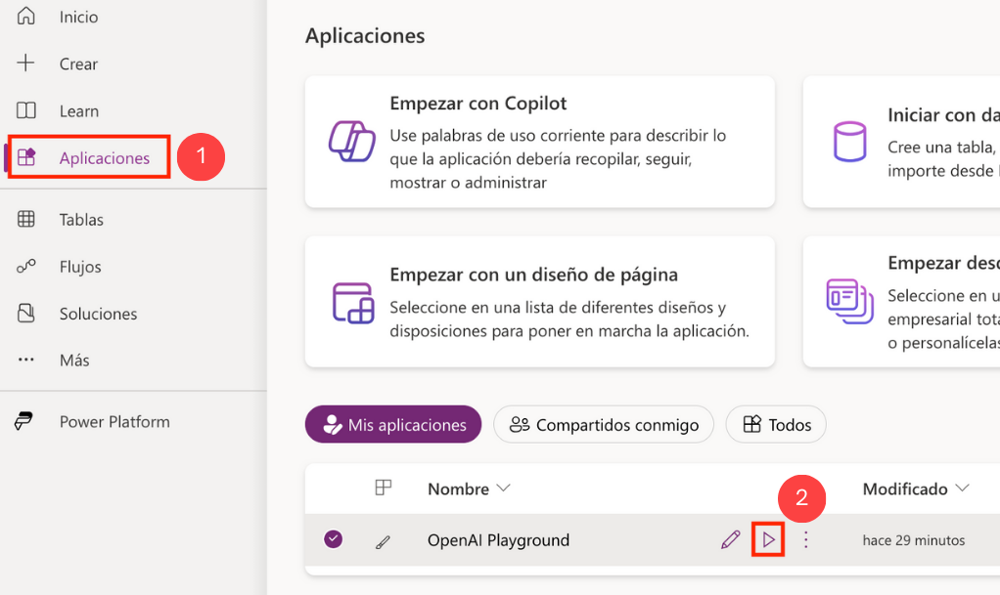

16. Si aparece una ventana emergente que le solicita iniciar una prueba gratuita, haga clic en **Iniciar una prueba gratuita**, luego en la ventana **Necesita una licencia de Power Apps para usar esta aplicación**, seleccione **Iniciar una prueba de 30 días**. Elija su región del menú desplegable y haga clic en el botón **Comenzar**. Espere de 2 a 3 minutos. Es posible que tarde en iniciar la prueba.
    
17. En el **Lienzo**, haga clic en el botón **Summary** **(1)** y verifique el **texto inicial** **(2)**. Luego haga clic en el botón **Submit** **(3)** para obtener el **Resumen** **(4)** deseado.

     

    > **Nota**: Puede probar las otras opciones disponibles en el portal, es decir, **SQL**, **ClassifyText**, **Parse**, y **Classify**.
