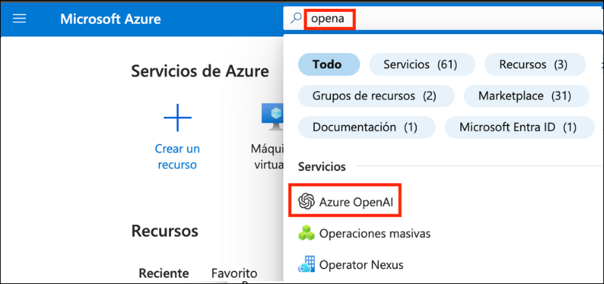
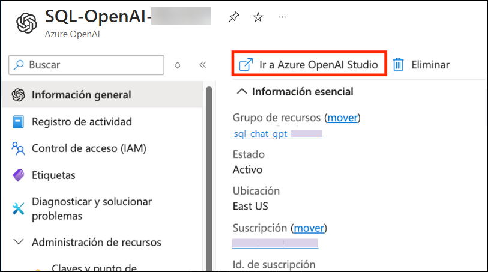
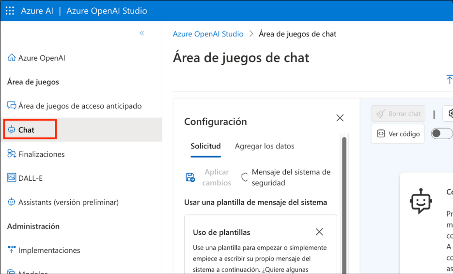
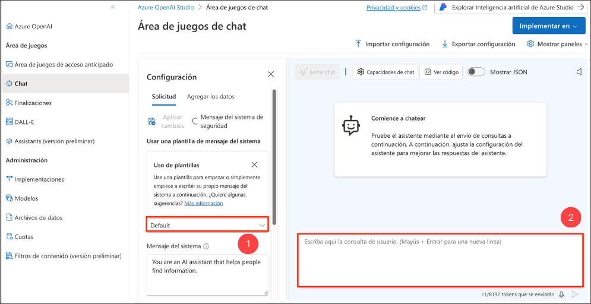

# Ejercicio 4a: Introducción a Prompt Engineering y Azure OpenAI Studio

En este ejercicio, explorará el concepto de ingeniería de prompts y aprenderá a crear prompt efectivos para modelos de IA. Obtendrá experiencia práctica con Azure OpenAI Playground, experimentará con diferentes tipos de prompts y comprenderá sus elementos y sugerencias de diseño.

## Temas

- [¿Qué es un prompt?](#qué-es-un-prompt)
- [¿Qué es ingeniería de prompts?](#qué-es-ingeniería-de-prompts)
- [Probando Ingeniería de Prompts con Azure OpenAI Playground](#probando-ingeniería-de-prompts-con-azure-openai-playground)
- [Ejemplos de Prompts Básicos](#ejemplos-de-prompts-básicos)
- [Elementos de un Prompt](#elementos-de-un-prompt)
- [Parámetros de Chat playground](#parámetros-de-chat-playground)
- [Consejos Generales para Diseñar Prompts](#consejos-generales-para-diseñar-prompts)


## Qué es un prompt


Todos hemos visto el cursor parpadeante. Esperando expectantes a que actuemos, denotando nuestra oportunidad de aportar información...

Una forma de pensar en un prompt es como un fragmento de texto que se utiliza para iniciar o proporcionar contexto para la generación de una salida, principalmente lenguaje natural en nuestros casos de uso, mediante el modelo de lenguaje. Podría ser una oración de entrada, una pregunta o un tema para generar una respuesta del modelo de lenguaje.

## Qué es ingeniería de prompts
La Ingeniería de Prompts es una [disciplina relativamente nueva](https://www.businessinsider.com/prompt-engineering-ai-chatgpt-jobs-explained-2023-3) para desarrollar y optimizar prompts para utilizar eficientemente modelos de lenguaje (LMs) en una amplia variedad de aplicaciones empresariales. Las habilidades de Ingeniería de Prompts ayudan a comprender mejor las capacidades y limitaciones de los modelos de lenguaje grandes (LLMs) y refinar las finalizaciones (salidas) de los LLMs. La Ingeniería de Prompts se utiliza para mejorar la capacidad de los LLMs en una amplia gama de tareas comunes y complejas, tales como como la respuesta a preguntas y el razonamiento aritmético. Los desarrolladores utilizan la ingeniería de prompts para diseñar técnicas de avisos sólidas y efectivas que interactúen con los LLMs y otras herramientas.

Esta guía cubre los conceptos básicos de prompts estándares para brindar una idea aproximada de cómo interactuar e instruir a los LLMs que se encuentran en [el Playground de Azure OpenAI Studio](https://oai.azure.com/portal/playground). 

### Probando Ingeniería de Prompts con Azure OpenAI Playground
Azure OpenAI Studio proporciona acceso a recursos de aprendizaje y la implementación, experimentación, personalización y administración de los modelos. Chat Playground dentro de Azure OpenAI Studio se basa en una interfaz de conversación de entrada y mensaje de salida. Puede inicializar la sesión con un mensaje del sistema para configurar el contexto del chat.

En el Chat playground, puede agregar ejemplos few-shot. El término few-shot se refiere a proporcionar algunos ejemplos para ayudar al modelo a aprender lo que debe hacer. Se puede pensar en ello en contraste con zero-shot, que se refiere a no proporcionar ejemplos.

En la configuración del Asistente, puede proporcionar algunos ejemplos few-shot de cuál puede ser la entrada del usuario y cuál debería ser la respuesta del asistente. El asistente intenta imitar las respuestas que incluye aquí con respecto al tono, las reglas y el formato que haya definido en el mensaje de su sistema.
Sigamos adelante y lancemos el Azure OpenAI Playground para aprender sobre ingeniería de prompts.

1. En el **Portal de Azure**, busque **OpenAI** y seleccione **Azure OpenAI**.

   

1. En la hoja **Azure AI services | Azure OpenAI**, seleccione **openai-<inject key="DeploymentID" enableCopy="false"/>**

1. En el panel de recursos Azure OpenAI, haga clic en **Ir a Azure OpenAI Studio** para navegar a **Azure AI Studio**.

   

1. En **Azure AI Studio**, haga clic en **Chat** debajo de **Área de juegos** en el menú de la izquierda.

    

1. En la sección **Chat**, elija **Default** **(1)** debajo de Usar una plantilla de mensaje del sistema. Luego, realice cualquier consulta desde la **Sesión de Chat** **(2)** para obtener la respuesta de openai. 

   > **Nota**: Haga clic en **Continuar** en **¿Desea actualizar el mensaje del sistema?** cuando se le solicite.
   
   
   > **Nota**: Es posible que el chat no responda con el resultado exacto que se muestra en las capturas de pantalla. A continuación se muestran ejemplos de lo que probablemente verá en este ejercicio, pero la respuesta puede variar.
 
    

---
## Ejemplos de Prompts Básicos

> **Nota:** Siéntase libre de ingresar cualquier cosa que aparezca en la casilla `Prompt:` en un modelo `text-davinci-003` en el [Playground de Azure OpenAI Studio](https://oai.azure.com/portal/playground) para seguir estos ejemplos de prompt. Tenga en cuenta que puede recibir resultados diferentes a los que aparecen en el cuadro `Salida:`, dada la naturaleza de los modelos generativos.

Puede lograr mucho con los prompts, pero la calidad de los resultados depende de la cantidad de información que proporcione en el prompt sin necesidad de ser demasiado descriptivo. Un prompt puede contener información como instrucciones o preguntas. Como aprenderemos más adelante con prompts más avanzados, también podemos proporcionar ejemplos de resultados requeridos, así como contexto para nuestras instrucciones.

Aquí hay un ejemplo básico de un prompt sencillo:

*Prompt:*
```
GPT-3 es
```
*Salida:*
```
 un modelo de lenguaje autorregresivo desarrollado por OpenAI. Significa Transformador Generativo Preentrenado 3.
 Es un modelo de lenguaje a gran escala que utiliza técnicas de aprendizaje profundo para generar texto similar al humano. GPT-3 utiliza una
 arquitectura basada en transformadores para generar texto con contexto.
```
> **Nota:** La `Salida` en nuestro ejemplo termina abruptamente porque nuestra variable **Longitud máxima (tokens)** está establecida en `=60`. **Longitud máxima (tokens)** establece un límite en la cantidad de tokens que se generarán en una respuesta. El modelo `text_davinci-003` admite un máximo de 2048 tokens compartidos entre un prompt determinado y la finalización de respuesta. (Un token tiene aproximadamente 4 caracteres para un texto típico en inglés).

La `Salida:` es una serie de cadenas de texto que tienen sentido dado el contexto proporcionado por nuestro mensaje de `"GPT3-3 es"`. Sin embargo, el resultado puede ser no deseado o inesperado según nuestro caso de uso. ¿Cómo podemos refinar o diseñar nuestro prompt para lograr el resultado deseado?

Lo primero que podemos hacer es proporcionar instrucciones explícitas sobre lo que queremos que haga el modelo con nuestro prompt anterior. Esto es lo que se entiende por _ingeniería de prompts_: refinar la entrada para producir el mejor resultado del LLM.

*Prompt:*
```
Cuéntame un chiste que comience con: GPT-3 es
```

*Salida:*
```
GPT-3 es tan inteligente que puede contar un chiste sin un remate.
```

¿Nuestras instrucciones mejoraron la salida? Es cierto que este no es el chiste más divertido jamás contado. Y a diferencia de los problemas de aprendizaje supervisado, no existe una métrica de error o pérdida fácil de comparar entre los dos resultados. Veamos exactamente lo que le pedimos al modelo que generara y lo que recibimos:
| Requisito | ¿La Salida Cumple con el Requisito? | 
|-------------|--------|
| Comienza con las palabras, "GPT-3 es" | Sí, la `Salida:` comenzó con las palabras "GPT-3 es" |
| La salida será en forma de una broma | Se hizo un intento |

---
## Prompts Estándar

Anteriormente vimos dos prompts muy básicos, así como la salida que generaron. Ahora que estamos familiarizados con los conceptos básicos de la ingeniería de prompts, veamos algunos formatos comunes para los prompts.

### Formato de Pregunta

```
<Pregunta>?
```
### Formato Pregunta-Respuesta (QA) 
Esto se puede formatear en un formato de QA, que es estándar en muchos conjuntos de datos de QA, de la siguiente manera:

```
Q: <Pregunta>?
A: 
```
Otra forma de pensar en esto, usando otros términos comunes, sería:
```
Prompt: <Pregunta>?
Finalización: <Respuesta>
```
### Formato Few-shot
Dado el formato estándar anterior, una técnica popular y eficaz para redactar prompts se conoce como prompts few-shot, donde proporcionamos múltiples ejemplos. Los prompts few-shot se pueden formatear de la siguiente manera:

```
<Pregunta>?
<Respuesta>

<Pregunta>?
<Respuesta>

<Pregunta>?
<Respuesta>

<Pregunta>?

```

### Formato Few-shot Pregunta-Respuesta (QA)
Y ya puede adivinar que su versión en formato QA tendría este aspecto:

```
Q: <Pregunta>?
A: <Respuesta>

Q: <Pregunta>?
A: <Respuesta>

Q: <Pregunta>?
A: <Respuesta>

Q: <Pregunta>?
A:
```

Tenga en cuenta que no es necesario utilizar el formato QA. El formato depende de la tarea en cuestión. Por ejemplo, puede realizar una tarea de clasificación simple y dar ejemplos que demuestren la tarea de la siguiente manera:

*Prompt:*
```
¡Esto es increíble! // Positivo
¡Esto es malo! // Negativo
¡Vaya, esa película fue genial! // Positivo
¡Qué espectáculo tan horrible! //
```

*Salida:*
```
Negativo
```
o

*Prompt*
```
La siguiente es una lista de empresas y las categorías en las que se encuentran.

Facebook: Redes sociales, Tecnología
LinkedIn: Redes sociales, Tecnología, Empresas, Carreras
Uber: Transporte, Tecnología, Mercado
Unilever: Conglomerado, Bienes de consumo
Mcdonalds: Comida, Comida Rápida, Logística, Restaurantes
FedEx:
```
*Salida:*
```
Logística, Entrega y Envío
```
Los prompts few-shot permiten el aprendizaje en contexto, que es la capacidad de los modelos de lenguaje para aprender tareas con solo unos pocos ejemplos. Veremos más de esto en acción en las próximas secciones de ingeniería de prompts avanzada.

---


## Elementos de un Prompt

A medida que cubrimos más y más ejemplos y aplicaciones que son posibles con la ingeniería de prompts, notará que hay ciertos elementos que componen un prompt.

Un prompt puede contener cualquiera de los siguientes componentes:

- **Instrucción** - Una tarea o instrucción específica que desea que realice el modelo

- **Contexto** - Puede implicar información externa o contexto adicional que puede orientar al modelo hacia mejores respuestas.

- **Datos de Entrada** - Es el dato o pregunta para la que estamos interesados ​​en encontrar una respuesta.

- **Indicador de Salida** - Indica el tipo o formato de salida.

No todos los componentes son necesarios para un prompt y el formato depende de la tarea en cuestión. Tocaremos ejemplos más concretos en nuestras próximas guías.

---

## Parámetros de Chat playground

Hay muchos parámetros que puede ajustar para cambiar el rendimiento de tu modelo:

- **Temperatura** - Controla la aleatoriedad. Bajar la temperatura significa que el modelo produce respuestas más repetitivas y deterministas. El aumento de la temperatura da como resultado respuestas más inesperadas o creativas. Intente ajustar la temperatura o P superior, pero no ambos a la vez.

- **Longitud máxima (tokens)** - Establece un límite en la cantidad de tokens por respuesta del modelo. La API admite un máximo de 4000 tokens compartidos entre el mensaje (incluido el mensaje del sistema, los ejemplos, el historial de mensajes y la consulta del usuario) y la respuesta del modelo. Un token tiene aproximadamente cuatro caracteres para un texto típico en inglés.

- **Secuencia de detención** - Hace que las respuestas se detengan en un punto deseado, como el final de una oración o lista. Especifique hasta cuatro secuencias en las que el modelo dejará de generar más tokens en una respuesta. El texto devuelto no contendrá la secuencia de detención.

- **Probabilidades máximas (P superior, Top P)** - similar a la temperatura, esto controla la aleatoriedad pero utiliza un método diferente. Reducir P superior disminuye la selección de tokens del modelo a los tokens más probables. El aumento de P superior permite al modelo elegir entre tokens con alta y baja probabilidad. Intente ajustar la temperatura o P superior, pero no ambos al mismo tiempo. 

- **Penalización de frecuencia** - Reduce la posibilidad de repetir un token proporcionalmente según la frecuencia con la que ha aparecido en el texto hasta el momento. Esto disminuye la probabilidad de repetir exactamente el mismo texto en una respuesta.

- **Penalización de presencia** - Reduce la posibilidad de repetir cualquier token que haya aparecido en el texto hasta el momento. Esto aumenta la probabilidad de introducir nuevos temas en una respuesta.

- **Texto previo a la respuesta** - Inserta texto después de la entrada del usuario y antes de la respuesta del modelo. Esto puede ayudar a preparar al modelo para una respuesta.

- **Texto posterior a la respuesta** - Inserte texto después de la respuesta generada por el modelo para fomentar la participación adicional del usuario, como cuando se modela una conversación.

- **Respuesta máxima** - Establece un límite en la cantidad de tokens por respuesta del modelo. La API admite un máximo de 4000 tokens compartidos entre el mensaje (incluido el mensaje del sistema, los ejemplos, el historial de mensajes y la consulta del usuario) y la respuesta del modelo. Un token tiene aproximadamente cuatro caracteres para un texto típico en inglés.

El recuento de tokens actual se puede ver desde el Chat Playground. Dado que las llamadas API tienen un precio por token y es posible establecer un límite máximo de tokens de respuesta, deberá estar atento al recuento de tokens actual para asegurar que la conversación entrante no exceda el recuento máximo de tokens de respuesta.

## Consejos Generales para Diseñar Prompts


A continuación se ofrecen algunos consejos a tener en cuenta al diseñar sus prompts:

### Comienzo Simple
Al comenzar a diseñar prompts, debe tener en cuenta que es un proceso iterativo que requiere experimentación para obtener resultados óptimos. El uso de un área de juegos simple como [el Playground de Azure OpenAI Studio](https://oai.azure.com/portal/playground) le permitirá probar ideas de manera rápida y sencilla. ¡El modelo no se ofenderá si le pide que haga cosas muy similares una y otra vez!

Puede comenzar con prompts simples e ir añadiendo más elementos y contexto a medida que vaya obteniendo mejores resultados. Por este motivo, es vital versionar su prompt a lo largo del camino. A medida que leamos la guía, verá muchos ejemplos en los que la especificidad, la simplicidad y la concisión a menudo le darán mejores resultados. Comience con un prompt codificado y avance a prompts generados más dinámicamente a medida que refine sus resultados.

### La Instrucción
Puede diseñar prompts efectivos para varias tareas simples mediante el uso de comandos para indicarle al modelo lo que desea lograr, por ejemplo "Escribe", "Clasifica", "Resume", "Traduce", "Ordena", "Crea", "Haz", etc.

Tenga en cuenta que también necesita experimentar mucho para ver qué funciona mejor. Pruebe diferentes instrucciones con diferentes palabras clave, contexto y datos y vea qué funciona mejor para su caso de uso y tarea particulares. Por lo general, cuanto más específico y relevante sea el contexto para la tarea que intenta realizar, mejor.

Otros recomiendan que las instrucciones se coloquen al principio del prompt. También se recomienda utilizar algunos separadores claros, como "###", para separar la instrucción y el contexto.

Por ejemplo:

*Prompt:*
```
### Instrucción ###
Traduce el siguiente texto al español:

Texto: "hello!"
```

*Salida:*
```
Texto:¡Hola!
```

### Especificidad
Sea muy específico acerca de las instrucciones y tareas que desea que realice el modelo. Cuanto más descriptivo y detallado sea el prompt, mejores serán los resultados. Esto es particularmente importante cuando se busca un resultado deseado o un estilo de generación en concreto. No hay tokens ni palabras clave específicos que conduzcan a mejores resultados. Es más importante tener un buen formato y un prompt descriptivo. Proporcionar ejemplos en el prompt es muy eficaz para obtener el resultado deseado en formatos específicos.

Al diseñar prompts, también debe tener en cuenta la longitud del prompt, ya que existen limitaciones en cuanto a su extensión. Pensar en qué tan específico y detallado debe ser es algo a considerar. Demasiados detalles innecesarios no son necesariamente un buen enfoque. Los detalles deben ser relevantes y contribuir a la tarea en cuestión. Esto es algo con lo que necesitará experimentar mucho. Recomendamos mucha experimentación e iteración para optimizar los prompts para sus aplicaciones.

A manera de ejemplo, intentemos con un prompt simple para extraer información específica de un fragmento de texto.

*Prompt:*
```
Son muchas las frutas que se encontraron en el recientemente descubierto planeta Goocrux. Hay neoskizzles que crecen allí,
los cuales son púrpuras y saben a caramelo. También hay heckles, que son una fruta de color azul grisáceo y muy ácidas,
un poco como un limón. Los pounits tienen un color verde brillante y son más salados que dulces. También hay muchas
loop novas, que tienen un color rosa neón y saben a algodón de azúcar. Por último, existen frutos llamados glowls, que tienen
un sabor agrio y amargo, muy ácido y cáustico, y un tinte naranja pálido.

Por favor haga una tabla que resuma las frutas de Goocrux.
| Fruta | Color | Sabor |
| Neoskizzles | Púrpura | Dulce |
| Loheckles | Azul grisáceo | Ácido |
```

*Salida:*
```
| Pounits | Verde brillante | Salado |
| Loopnovas | Rosa neón | Algodón de azúcar |
| Glowls | Naranja pálido | Agrio y amargo |
```

> **Nota:** Las instrucciones son `Por favor, haga una tabla que resuma las frutas de Goocrux`, y luego se proporciona una tabla de muestra con encabezados de columna y dos ejemplos, con los elementos correctos en sus respectivas columnas, lo que hace que esto sea un prompt few-shot.

### Evite la Imprecisión

Teniendo en cuenta los consejos anteriores sobre cómo ser detallado y mejorar el formato, es fácil caer en la trampa de querer ser demasiado inteligente con los prompts y crear descripciones potencialmente imprecisas. A menudo es mejor ser específico y directo. Al modelo no le importa que usted sea explícito en sus instrucciones; ¡no puedes ofenderlo! La analogía aquí es muy similar a la comunicación efectiva: cuanto más directa, más efectivamente se transmite el mensaje.

Por ejemplo, es posible que le interese aprender el concepto de ingeniería de prompts. Podría intentar algo como:

*Prompt:*
```
Proporcione una breve explicación de qué es la ingeniería de prompts en NLP sin utilizar lenguaje técnico.
```
*Salida:*
```
La ingeniería de prompts en NLP es el proceso de crear preguntas o prompts para ayudar a una computadora a comprender
lenguaje natural. Implica crear preguntas o declaraciones que se pueden utilizar para incitar a una computadora a generar
una respuesta en lenguaje natural.
```

No queda claro en el prompt anterior cuántas oraciones usar, en qué estilo necesitamos que se produzca la salida o qué pretendemos extraer de la salida. Es posible que obtenga respuestas aceptables con el prompt anterior; lo mejor sería que fuera muy específico, conciso y directo. Algo como:

*Prompt:*
```
Proporciona una lista con cinco viñetas, de una oración cada una, que describan los beneficios de la ingeniería de
prompts cuando interactua con un modelo de lenguaje grande utilizando un nivel de comprensión de lectura de octavo grado
```
*Salida:*
```
• Aumenta la eficiencia al reducir la necesidad de intervención del usuario.
• Mejora la experiencia del usuario al reducir el tiempo de espera de una respuesta.
• Reduce la carga cognitiva al simplificar el lenguaje y proporcionar instrucciones claras.
• Mejora la precisión al proporcionar un formato consistente para la introducción de datos lingüísticos.
• Mejora la escalabilidad al permitir la integración de modelos de lenguaje más complejos.
```

### ¿Hacer o no hacer?
Otro consejo común al diseñar prompts es evitar decir qué no hacer, sino decir qué hacer. Esto fomenta una mayor especificidad y un enfoque en los detalles que conducen a buenas respuestas del modelo.

A continuación se muestra un ejemplo de un chatbot de soporte de TI que no cumple con nuestras instrucciones porque están redactadas de manera negativa.

*Prompt:*
```
El siguiente es un intercambio entre un agente de soporte de TI y un cliente. El cliente no puede acceder a su cuenta. NO PIDA SU CONTRASEÑA. NO PREGUNTE SOBRE INFORMACIÓN PERSONAL.

Cliente: No puedo iniciar sesión en mi cuenta.
Agente de Soporte de TI:
```

*Salida:*
```
Está bien, lo entiendo. ¿Puede decirme la dirección de correo electrónico con la que está intentando iniciar sesión?
```

Aquí hay un mejor prompt:

*Prompt:*
```
El siguiente es un intercambio entre un agente de soporte de TI y un cliente. El cliente no puede acceder a su cuenta. El Agente de Soporte de TI no debe discutir información personal como el nombre de usuario, la contraseña, el nombre, la dirección de correo electrónico, el número de cuenta o el número de teléfono, o las preguntas de seguridad. Si el Agente de Soporte de TI necesita información personal para ayudar al cliente, debe pedirle que haga clic en el enlace "¿Olvidó su contraseña?" en la página de inicio de sesión y siga las instrucciones en pantalla.

Cliente: No puedo iniciar sesión en mi cuenta.
Agente de Soporte de TI:
```

*Salida:*
```
Le pido disculpas por tener dificultades para acceder a su cuenta. Por favor haga clic en el enlace "¿Olvidó su contraseña?" en la página de inicio de sesión y siga las instrucciones en pantalla para restablecer su contraseña y acceder a su cuenta.
```

Algunos de los ejemplos anteriores se adoptaron del artículo [Mejores prácticas para ingeniería de prompts con API OpenAI](https://help.openai.com/en/articles/6654000-best-practices-for-prompt-engineering-with-openai-api) y la  
[Guía de Ingeniería de Prompts para Democratizar la Investigación, la Educación y las Tecnologías de la Inteligencia Artificial](https://github.com/dair-ai/Prompt-Engineering-Guide)

**Resumen:** En este ejercicio, aprendió a crear poderosos prompts para modelos de IA examinando la idea de ingeniería de prompts en esta tarea. Con Azure OpenAI Playground, adquirió experiencia práctica al experimentar con varios tipos de prompts y comprender sus componentes y consejos de diseño.